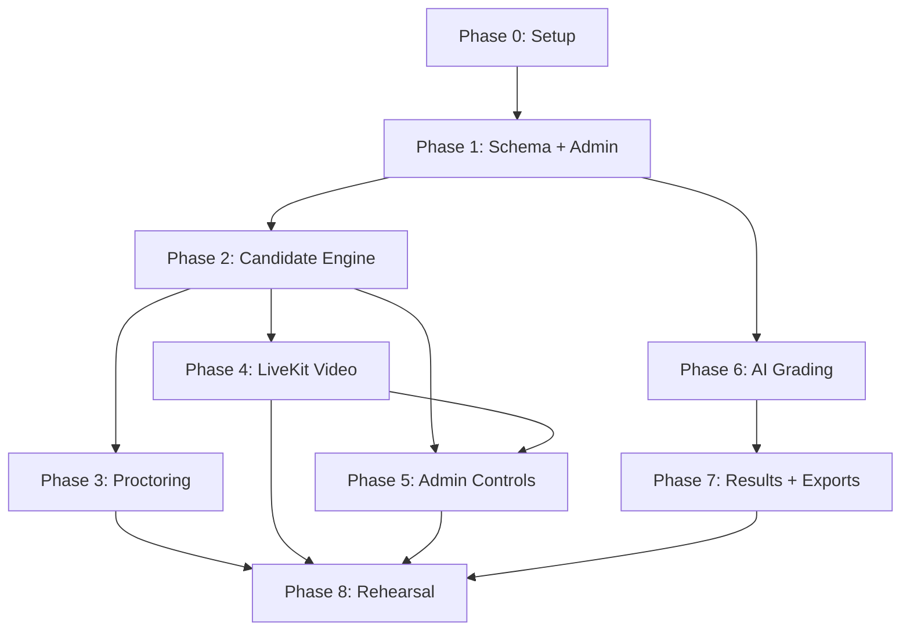

# Implementation Plan — Exam Platform

Detailed task breakdown for each phase. Tasks are ordered by dependency within each phase.

> [!IMPORTANT]
> This plan incorporates all fixes from `Issues.md` (rounds 1–11). Changes are marked with 🔧 (fix) or ➕ (new task).
> Round 2: 🔧². Round 3: 🔧³. Round 4: 🔧⁴. Round 5: 🔧⁵. Round 6: 🔧⁶. Round 7: 🔧⁷. Round 8: 🔧⁸. Round 9: 🔧⁹. Round 10: 🔧¹⁰. Round 11: 🔧¹¹.

---

## Phase 0 — Setup (0.5–1 day)

**Dependencies:** none

### Tasks

| # | Task | Files | Details |
|---|---|---|---|
| 0.1 | Initialize Next.js + TypeScript | `apps/web/` | `npx create-next-app@latest` with App Router, TypeScript, ESLint |
| 0.2 | Install core dependencies | `package.json` | `@supabase/supabase-js`, `@supabase/ssr`, `iron-session`, 🔧 `sanitize-html` (replaces `dompurify` — needs browser DOM on server), `@node-rs/argon2` |
| 0.3 | Supabase project setup | Supabase dashboard | Create project, note URL + anon key + service role key |
| 0.4 | Environment config | `.env.local`, `.env.example` | All variables from §14.1; `.env.example` with placeholder values for team reference. 🔧² **Include `ALERT_WEBHOOK_URL`** (Telegram/Discord). 🔧⁹ **Add `SNAPSHOT_RETENTION_DAYS`** (default `14`), **`NEXT_PUBLIC_LIVEKIT_URL`** |
| 0.5 | Supabase client helpers | `lib/supabase/server.ts`, `lib/supabase/client.ts` | Server client (service role), browser client (anon key for admin Realtime only) |
| 0.6 | iron-session config | `lib/session.ts` | Session options with `secure: process.env.NODE_ENV === 'production'`, cookie name, TTL = exam duration + 2 hours |
| 0.7 | Vercel project | Vercel dashboard | Connect repo, set env vars, confirm auto-deploy |
| 0.8 | Git repo + structure | root | Create folder structure from §14.6; initial commit |
| ➕ 0.9 | Logger config | `lib/logger.ts` | 🔧 Configure logger to **never log request bodies** — NIC/ID data must not appear in logs |
| ➕ 0.10 | Public health endpoint | `app/api/health/route.ts` | 🔧🔧⁹ Simple public endpoint for UptimeRobot. Response: `{ ok: true, time }` on success; `503 { ok: false }` on Supabase failure. No detail |

**Done when:** deployed app reads a row from Supabase and iron-session creates a test cookie on localhost.

---

## Phase 1 — Schema, Admin Auth, Candidates, Questions (2–3 days)

**Dependencies:** Phase 0

### 1A — Database (0.5 day)

> [!IMPORTANT]
> 🔧⁶ **Section 1 is written.** The full migration SQL, smoke test, and per-task edits are in [`SECTIONS/section-1-migration.md`](file:///e:/1.%20Projects/Cosmetics.lk/Projects/Cosmetics_Exam/SECTIONS/section-1-migration.md). The individual schema tasks below are kept for reference, but **do not hand-write SQL from them** — use the written `001_initial.sql` file.

| # | Task | Files | Details |
|---|---|---|---|
| 1A.1 | Run migration | `supabase/migrations/001_initial.sql` | 🔧³🔧⁶🔧⁷ Save `SECTIONS/001_initial.sql` as `supabase/migrations/001_initial.sql`. Run in the Supabase SQL editor. **Requires a fresh Supabase project** (the file creates tables, publications, and a storage bucket — it is not re-runnable). **Requires Postgres 15+** (`security_invoker` views). New Supabase projects have this. The SQL has never been executed — the smoke test is the real proof. Do **not** hand-write schema from the task rows below — the file is the source of truth |
| 1A.2 | Run smoke test | `SECTIONS/001_smoke_test.sql` | 🔧⁶🔧⁷ Run in SQL editor after the migration. It verifies: attempt auto-creation, paper idempotency, sequential Next + idempotency, position guard, revision rule, submit + closed saves, override-wins scoring, incident counting, alert dedup, multi-chunk grading jobs. Rolls itself back. **Expect the notice `SMOKE TEST PASSED`** |
| 1A.3 | Verify RLS | Dashboard | 🔧⁶ Done in the migration: RLS on every table; admins full access; super-admin-only for `alerts`, `system_health`, `api_key_state`; `sessions` and `login_attempts` are service-role only (RLS on, no policies) |
| 1A.4 | Verify Realtime | Dashboard → Replication | 🔧⁶ Done in the migration: `attempts`, `violation_events`, `grading_jobs`, `grading_log`, `alerts`, `exams` |
| 1A.5 | Verify Storage | Dashboard | 🔧⁶ Done in the migration: private `snapshots` bucket + admin read policy |
| 1A.6 | Seed admin users | Dashboard + SQL | 🔧⁶ Create users in Dashboard → Auth → Users, then `INSERT INTO admin_profiles (id, name, role) VALUES ('<uuid>', 'Name', 'super_admin')`. `api_key_state` (key1–key3) and `system_health` (worker) are seeded by the migration |

**What the migration provides (reference — do not duplicate):**

| Area | What |
|---|---|
| Tables | `admin_profiles`, `candidates` (🔧⁵ no `photo_url`), `exams` (incl. `ends_at`, `force_ended_at`, `navigation_mode`), `exam_candidates`, `questions`, `mcq_options`, `answer_keys`, `attempts` (incl. `current_position`, `submit_reason`, `extra_minutes`, `violation_count`), `attempt_questions` (incl. `option_order`), `sessions`, `answers` (incl. `revision`, `flagged`), `violation_events` (🔧⁶ one row per incident: `type`, `merged_types`, `counts`, `snapshot_path`), `grading_runs` (incl. `kind`), `grading_jobs` (🔧⁶ `chunk_index` added, unique on `(run_id, attempt_id, chunk_index)`), `question_scores` (incl. `details`, `needs_review`, `job_id`), `results`, `api_key_state`, `grading_log`, `login_attempts` (incl. `success`), `alerts` (incl. `severity`, `unique_key`; dedup via partial unique index), `system_health`, `admin_actions`, `broadcasts` |
| Functions | `generate_paper(p_attempt_id)` — atomic paper creation, locks attempt row, moves to `in_progress`; `save_answer(...)` — revision check, deadline+15s, force-end, position guard, option validation, all with DB clock; `advance_position(...)` — sequential Next, idempotent via `expected_position`; `submit_attempt(p_attempt_id, p_reason)` — idempotent submit |
| Triggers | `sync_attempt_on_assign` (🔧⁶ auto-creates attempt on `exam_candidates` insert), `bump_violation_count` (increments `attempts.violation_count` only for `counts = true` incidents), `set_updated_at` on results |
| Views | `current_scores` (override always wins, then latest `created_at`), `attempt_progress` (for admin grid: `current_position`, `total_questions`, `answered_count`, `flagged_count`), `attempt_deadlines` (per-attempt `deadline` and `grace_deadline` for the scheduler) |
| Hardening | Browser `anon` key revoked from all tables/sequences; exam-engine functions are service-role only |

**Done when:** 🔧⁷ migration runs without errors; smoke test prints `SMOKE TEST PASSED`; Dashboard shows RLS enabled on all tables, Realtime on the 6 listed tables, and the `snapshots` bucket exists.

### 1B — Admin Auth + Layout (0.5 day)

| # | Task | Files |
|---|---|---|
| 1B.1 | Admin login page | `app/(admin)/admin/login/page.tsx` |
| 1B.2 | Auth middleware | `middleware.ts` or layout-level check |
| 1B.3 | Admin layout with sidebar | `app/(admin)/admin/layout.tsx` |
| 1B.4 | Role-based access helper | `lib/auth.ts` — `requireAdmin()`, `requireSuperAdmin()` |
| 🔧 1B.5 | Auth in route handlers | All admin API routes | 🔧 Call `requireAdmin()` **inside every admin route handler**, not only in middleware. Defense in depth against Next.js middleware bypass |

### 1C — Candidates (0.5 day)

| # | Task | Files |
|---|---|---|
| 1C.1 | NIC hashing utility | `lib/hashing.ts` — 🔧 **normalize before hashing**: trim whitespace, uppercase, convert old NIC format (9-digit + V/X) ↔ new format (12-digit). Use `@node-rs/argon2` (native `argon2` breaks on Vercel) + pepper |
| 1C.2 | Candidate list page | `app/(admin)/admin/candidates/page.tsx` |
| 1C.3 | Add/edit candidate form | `app/(admin)/admin/candidates/[id]/page.tsx` — 🔧⁵🔧⁶ **No photo field** (everyone is in the office; `photo_url` removed from schema) |
| 1C.4 | CSV import | `app/api/admin/candidates/import/route.ts` — 🔧⁹ **Cap 100 rows per request** (hashing 300 NICs with argon2 risks the Vercel function time limit). Client sends batches of 50. Support `dry_run` mode and `on_duplicate` strategy |
| 1C.5 | Candidate API routes | `app/api/admin/candidates/route.ts` — 🔧⁹ **Add `app/api/admin/candidates/[id]/route.ts`** (PATCH, DELETE) and optional `[id]/unlock/route.ts` (clears `login_attempts` for that MER) |

### 1D — Exams (0.5 day)

| # | Task | Files |
|---|---|---|
| 1D.1 | Exam list page | `app/(admin)/admin/exams/page.tsx` |
| 1D.2 | Create/edit exam form | `app/(admin)/admin/exams/[id]/page.tsx` — includes `questions_per_paper`, `shuffle`, `flag_threshold`, schedule. 🔧 **Convert Colombo time input to UTC** before storing. 🔧³ **Add `navigation_mode` toggle** (sequential / free). Locked once exam is live — changing mode mid-exam would break candidates' progress |
| 1D.3 | Assign candidates to exam | Same page or sub-page. 🔧⁶ **Assigning a candidate auto-creates their attempt** (DB trigger on `exam_candidates`). Unassigning removes the attempt only if still `not_started`. The admin live grid shows "Not joined" for all assigned candidates before anyone logs in. 🔧⁹ **Add `app/api/admin/exams/[id]/candidates/route.ts`** (GET, POST, DELETE). 🔧¹⁰ Unassign returns `200 { removed: [...], blocked: [...] }` (not 409) — tells the admin which candidates couldn’t be removed because their attempt has started |
| 1D.4 | Exam API routes | `app/api/admin/exams/route.ts` — 🔧⁷ **Enforce `navigation_mode` lock server-side**: the update route must reject changes to `navigation_mode` (and `questions_per_paper`, `shuffle`, `duration_min`, `scheduled_start_at`) once the exam status is `live` or later. Without this, the UI-only lock (1D.2) is cosmetic. 🔧⁹ **Add `app/api/admin/exams/[id]/route.ts`** (GET, PATCH, DELETE). `status` only changes `draft` ↔ `scheduled` here |

### 1E — Question Builder (1 day)

| # | Task | Files |
|---|---|---|
| 1E.1 | Install Tiptap | `package.json` — `@tiptap/react`, `@tiptap/starter-kit`, extensions |
| 1E.2 | Tiptap editor component | `components/editor/TiptapEditor.tsx` |
| 1E.3 | Question builder page | `app/(admin)/admin/exams/[id]/questions/page.tsx` |
| 1E.4 | MCQ option editor | `components/editor/McqOptions.tsx` — add/remove options, mark correct |
| 1E.5 | Written answer fields | Model answer, grading notes, calibration examples |
| 1E.6 | Drag-and-drop ordering | Question position reordering. 🔧⁹ **Add `app/api/admin/questions/reorder/route.ts`** |
| 1E.7 | Question API routes | `app/api/admin/questions/route.ts`, `app/api/admin/answer-keys/route.ts` — 🔧⁸ **Lock questions once exam is live**: reject adding/deleting questions, changing question `type` or `body_html`, and adding/removing MCQ options. The schema cascades deletes, so deleting a question mid-exam silently removes it from every candidate’s paper and their answer. Adding a question wouldn’t appear in already-generated papers. Body text edits wouldn’t update screens that have already loaded. **Allow answer key edits** (`model_answer`, `grading_notes`, `calibration`) since they’re only used at grading time. Full request/response spec in Section 3 (API contracts). 🔧⁹ **Add `app/api/admin/questions/[id]/route.ts`** (PATCH, DELETE). `answer-keys/route.ts` is GET + PUT. 🔧¹⁰ **HTML allowlist** from Section 3 §4.3: `p, strong, em, u, s, ul, ol, li, br, sub, sup, span[style]`. Strip everything else via `sanitize-html` (1E.8) |
| 1E.8 | Server-side HTML sanitization | 🔧 Use `sanitize-html` (not `dompurify`) — sanitize all HTML before DB write |

**Done when:** an admin builds an exam with 40 questions (mixed MCQ + written), sets `questions_per_paper = 20`, assigns 23 candidates.

---

## Phase 2 — Candidate Login and Exam Engine (3–4 days)

**Dependencies:** Phase 1

### 2A — Candidate Auth (0.5 day)

| # | Task | Files |
|---|---|---|
| 2A.1 | Login page | `app/(candidate)/login/page.tsx` — MER code + NIC input. 🔧 **Show which exam** the candidate is joining if multiple exist |
| 2A.2 | Login API | `app/api/auth/login/route.ts` — 🔧 Normalize NIC → hash → verify; check `login_attempts` rate limit (**failed only**); 🔧 **check candidate is assigned to the exam**; create iron-session; revoke older sessions. 🔧⁹ **Exam selection**: if the candidate is assigned to exactly one live/scheduled exam, use it. If multiple, require `exam_id` in the request or return `409 multiple_exams`. Log a `MULTI_LOGIN` event when revoking a session that was in-progress; log `RECONNECTED` when the previous session was not in-progress |
| 2A.3 | Rate limit check | Query `login_attempts` for count of 🔧 **`success = false`** in last 10 min per MER and per IP. 🔧¹⁰ **All 23 candidates share one office IP** — set the per-IP threshold high enough (e.g. 50+ per 10 min) so legitimate logins are never blocked. The per-MER limit (5 failures) is the real protection |
| 2A.4 | Session middleware | `lib/session.ts` — `getSession()` helper for candidate routes. 🔧 **Check session ID against `sessions.revoked_at`** on every candidate API call (not just at login) — makes session revocation actually enforced |
| 2A.5 | Confirmation page | `app/(candidate)/confirm/page.tsx` — 🔧⁵ show name and outlet **(no photo)**, acknowledge button. 🔧⁹ **This page only navigates** — no API call. The actual acknowledge call happens from the rules screen |
| 2A.6 | Acknowledge API | `app/api/auth/acknowledge/route.ts` — 🔧⁹ **Called once from the rules screen** with both `identity_confirmed` and `rules_accepted` flags. `acknowledged` means identity confirmed **and** rules accepted. Idempotent |
| ➕ 2A.7 | Me API | 🔧⁹ `app/api/auth/me/route.ts` — `GET /api/auth/me`. Returns candidate name, outlet, exam title, and attempt status. Used by the confirm and rules screens to show identity and exam info |
| ➕ 2A.8 | Logout API | 🔧⁹ `app/api/auth/logout/route.ts` — `POST /api/auth/logout`. Revokes the session and clears the cookie. Called from the Done page |

### 2B — Waiting Room + Broadcast (0.5 day)

| # | Task | Files |
|---|---|---|
| 2B.1 | Broadcast channel hook | `lib/broadcast.ts` — subscribe to `exam:{examId}` channel |
| 2B.2 | Broadcast publish helper | `lib/broadcast-server.ts` — server-side publish for admin actions |
| 2B.3 | Waiting room page | `app/(candidate)/waiting/page.tsx` — countdown, camera preview, Broadcast listener. 🔧 **Enforce fullscreen here too** with blocking overlay. 🔧² **Add 5–10 second interval poll** of exam state API as fallback. 🔧⁹ **Heartbeat is the poll**: `POST /api/heartbeat` every 10s returns the state body. 🔧¹⁰ **State body uses the contract's shape** (not `{ phase, remaining_s, broadcast }`): returns `server_time`, exam details (including `scheduled_start_at`, `ends_at`, `navigation_mode`), and attempt details (including `deadline`). The plan's simpler shape couldn't drive the countdown when the admin starts the exam manually or changes the time |
| 2B.4 | Time sync | `app/api/time/route.ts` + `lib/time.ts` — server clock offset calculation |
| 2B.5 | Exam state API (fallback) | `app/api/exam/state/route.ts` — 🔧²🔧⁹🔧¹⁰ Returns the same full state body as the heartbeat (server_time + exam + attempt). Heartbeat returns this same shape, so the waiting room doesn't need a separate poll |
| ➕ 2B.6 | Consent / rules screen | `app/(candidate)/rules/page.tsx` | 🔧 Display: camera and audio are monitored live, snapshots are stored, and when they'll be deleted. 🔧² **Include specific deletion timeframe**. 🔧¹⁰ **Show the retention number from `/api/auth/me`** (14 days). 🔧³ **State which navigation mode applies** (sequential or free). 🔧⁵ **Include candidate setup instructions**: Laptops — use a Chrome Guest window, no second screen, camera and mic on. Tablets — Chrome only, "Desktop site" off, run the pre-exam check the day before (for first-time OS camera permissions). These instructions currently live only in the old main plan. Must be acknowledged before proceeding |

### 2C — Paper Delivery + Question Pool (0.5 day)

| # | Task | Files |
|---|---|---|
| 2C.1 | Paper API | `app/api/exam/paper/route.ts` | 🔧³ **Mode-aware**: in `free` mode, return all questions. In `sequential` mode, return **only the current question** (by `current_position`) plus the total count ("Question 7 of 20"). 🔧⁹ **Options have no `label`** — the fixed `mcq_options.label` (a,b,c,d) would read "c,a,d,b" after shuffling. The UI letters options A,B,C… by position instead. **Return saved `revision`** for each answer so the client can resume its counter after reconnect |
| 2C.2 | Question pool selection | 🔧🔧⁶ Call `supabase.rpc('generate_paper', { p_attempt_id })`. The DB function handles locking, atomic question selection, shuffle, option order, and moves the attempt to `in_progress`. If `attempt_questions` already exist, it returns the saved set (idempotent). Map raised exceptions: `not_acknowledged` → 403, `attempt_closed`/`exam_not_live` → 409, `exam_has_no_questions` → 409 |
| 2C.3 | Shuffle logic | 🔧⁶ **Handled inside `generate_paper()`** — if `shuffle` is enabled, question order and option order are both randomized atomically. The API route does not implement shuffle separately |

### 2D — Exam UI (1 day)

| # | Task | Files |
|---|---|---|
| 2D.1 | Exam page layout | `app/(candidate)/exam/page.tsx` — timer, save indicator. 🔧² **All candidate page transitions must be client-side navigation** (`router.push` / `<Link>`), never full page loads — a full reload kills fullscreen and the LiveKit connection. 🔧³ **Two layout modes**: free mode shows a question list sidebar (answered/unanswered indicators, Previous/Next, summary screen before submit); sequential mode shows one question at a time with a Next button only. 🔧³ **Block browser Back button** (`history.pushState` loop or `beforeunload`) so it doesn't leave the exam page. 🔧⁴ **Set `overscroll-behavior: none`** on the exam page — pull-to-refresh on Android reloads the page, exits fullscreen, and drops the camera. 🔧⁴ **Use `100dvh`** (not `100vh`) for layouts — on Android the on-screen keyboard resizes the viewport; `dvh` keeps the timer/Next/Submit button visible above it |
| 2D.2 | Question renderer | `components/exam/QuestionCard.tsx` — renders HTML body, MCQ radios 🔧 **using saved `option_order`**, written textarea |
| 2D.3 | Timer component | `components/exam/Timer.tsx` — server-synced with offset. 🔧 Deadline = `exams.ends_at + attempts.extra_minutes` |
| 2D.4 | Save indicator | `components/exam/SaveIndicator.tsx` — green/yellow/orange states |
| 2D.5 | MCQ answer handler | Radio button selection → state |
| 2D.6 | Written answer handler | Textarea with Unicode Sinhala support. 🔧⁴ **Disable `autocorrect`, `autocomplete`, and `spellcheck`** on the answer textarea. Never rely on `keydown` events (Android keyboards report generic key codes) — use `input` events instead |
| ➕ 2D.7 | Sequential mode Next button | 🔧³ `components/exam/NextButton.tsx` — warns when answer is blank ("You can't come back to this question"). On the last question, button becomes "Submit Exam". Waits for server confirmation before advancing; if connection is down, shows "Reconnecting…" instead of advancing. IndexedDB still protects the text locally. 🔧⁴ **Debounce / disable on click** to prevent double-taps (see 2F.6 for server-side idempotency) |
| ➕ 2D.8 | Free mode question list | 🔧³ `components/exam/QuestionList.tsx` — sidebar listing all questions with answered/unanswered/🔧⁴ **flagged** indicators (reads `answers.flagged`). Click to jump to any question. 🔧⁴ **Flag toggle button** on each question. Summary screen before final submit shows unanswered and flagged questions |
| ➕ 2D.9 | Touch layout | 🔧⁴ `styles/tablet.css` or responsive rules — **768–1024px widths** in both orientations. Minimum **44px touch targets** on all interactive elements. No hover-only controls. Ensure question list sidebar is usable on tablet portrait |

### 2E — Autosave + Offline (0.5 day)

| # | Task | Files |
|---|---|---|
| 2E.1 | IndexedDB helper | `lib/indexeddb.ts` — save/load/queue operations |
| 2E.2 | Autosave hook | `hooks/useAutosave.ts` — debounce 1s, periodic 10s, IndexedDB write, server upsert. 🔧 **Increment `revision` integer per question per save** (client-side counter). 🔧⁹ **Revision recovery on reconnect**: on paper load, set each question’s revision counter to `max(server_revision, local_revision) + 1`. If a save returns `stale_revision` with `server_revision`, update the counter to `server_revision + 1` and retry |
| 2E.3 | Retry queue | Failed saves queued and retried; indicator updates |
| 2E.4 | Answers API | `app/api/answers/route.ts` — 🔧⁶ **Call `supabase.rpc('save_answer', { p_attempt_id, p_question_id, p_answer_text, p_selected_option_id, p_flagged, p_revision })`**. The DB function enforces: revision check (only higher overwrites), deadline + 15s grace (DB clock), force-end, attempt/exam status, sequential position guard (current question only), and option validation — all atomically. Map results: `saved` → 200, `stale_revision` → 200 (client drops queued write; 🔧⁹ **return `server_revision`** so client can recover), `closed` → 409 (client locks UI), `wrong_position` → 409, `not_in_paper`/`bad_option` → 400, `not_found` → 404 |

### 2F — Submit + Reconnect (0.5 day)

| # | Task | Files |
|---|---|---|
| 2F.1 | Submit API | `app/api/exam/submit/route.ts` — 🔧⁶ Call `supabase.rpc('submit_attempt', { p_attempt_id, p_reason: 'manual' })`. The DB function is idempotent (returns `false` if already submitted). 🔧⁹ **Require `in_progress`** status — the DB function accepts `not_started` and `acknowledged` (for the scheduler), but the candidate submit route must reject those to prevent submitting from the waiting room. **Accept `pending_answers`** array: save each answer before submitting, so deadline-flush doesn’t race |
| 🔧² 2F.2 | Manual submit + auto-submit | 🔧² **Manual "Submit Exam" button with confirm dialog** ("Are you sure? You cannot change your answers after submitting."). In sequential mode, the last question's Next button becomes this Submit button. Auto-submit on deadline: 🔧 **lock UI at deadline** (disable all inputs), flush answers within 15s grace, call submit with `p_reason = 'auto'` |
| 2F.3 | Done page | `app/(candidate)/done/page.tsx` — "Submitted" confirmation |
| 2F.4 | Reconnect flow | Login with same MER + ID → load existing attempt, saved answers, same question subset 🔧 **with same option order**, remaining time. 🔧³ **In sequential mode, resume at `current_position`** (not question 1). The paper API returns only that question |
| 2F.5 | Worker scheduler | `worker/src/scheduler.ts` — 30s loop: move scheduled→live exams (🔧 set `exams.ends_at`). 🔧⁴🔧⁶ **Exam state transitions**: read per-attempt deadlines from the `attempt_deadlines` view (`grace_deadline`). Force-submit each attempt after its own `grace_deadline` passes via `rpc('submit_attempt', { p_reason: 'forced' })`. Mark exam `ended` only after the **last** attempt's `grace_deadline`. Then mark `finalized` (also sets attempts `submitted → finalized`). The grading guard (6D.1) depends on `finalized` status |
| 2F.6 | Next question API | 🔧³ `app/api/exam/next/route.ts` — 🔧⁶ Call `supabase.rpc('advance_position', { p_attempt_id, p_expected_position, p_question_id, p_answer_text, p_selected_option_id, p_revision })`. Map results: `advanced` → fetch question at `out_position` and return it in the same response; `already_advanced` → same (lost reply, safe retry); `out_of_sync` → reload current question; `last_question` → 🔧⁹ **save the answer first** (the DB function returns before saving on last question), then return `submit_now: true`; `closed` → lock UI; `wrong_question`/`not_sequential` → reload state |

**Done when:** a test candidate gets 20 random questions from 40, answers some, disconnects, reconnects and sees the same 20 questions with saved answers and same shuffled option order, and gets auto-submitted at deadline. In sequential mode, reconnect resumes at the correct position and earlier questions can't be re-answered.

---

## Phase 3 — Proctoring and Logs (2–3 days)

**Dependencies:** Phase 2

### 3A — Proctoring Events (1 day)

| # | Task | Files |
|---|---|---|
| 3A.1 | Proctoring hook | `hooks/useProctoring.ts` — attaches all event listeners. 🔧 **Includes incident dedup logic**: merge events within ~3 seconds into one incident (e.g., FULLSCREEN_EXIT + FOCUS_LOST + VIEWPORT_CHANGED from one alt-tab = 1 incident, not 3 violations). 🔧⁶ **Send one `violation_events` row per incident**: `type` = the first/primary event, `merged_types` = array of any other event types merged into this incident. 🔧⁹ **Server decides `counts`** — the client does NOT send a `counts` flag. The server sets `counts = false` for informational types (e.g. `RECONNECTED`) and for events during the waiting room phase. **Waiting-room incidents do not count** toward the flag threshold (the fullscreen blocker handles that phase), but if the same fault persists into the exam without being fixed, the exam-phase incidents **do** count |
| 3A.2 | Visibility change handler | `visibilitychange` → `TAB_HIDDEN` |
| 3A.3 | Focus handler | `window blur` + 1s `document.hasFocus()` check → `FOCUS_LOST` |
| 3A.4 | Fullscreen handler | `fullscreenchange` → `FULLSCREEN_EXIT` + blocking overlay. 🔧⁴🔧⁵ **Lock orientation** after entering fullscreen — lock to **the orientation the candidate is already in** (`screen.orientation.lock(screen.orientation.type)` on Android — only works in fullscreen). Do NOT hardcode `'portrait'` — tablets are often held in landscape and forcing portrait would cause an unwanted rotation. Unlock orientation when fullscreen ends |
| 3A.5 | Viewport check | 🔧 **Only run while in fullscreen**. 1s interval: `innerWidth` vs `screen.width` → `VIEWPORT_CHANGED` (width-only on Android). 🔧⁴ **"Desktop site" mode** makes the viewport report a wider width — the pre-exam check (5B) should detect and warn about this |
| 3A.6 | Multi-screen check | 🔧⁴ **Guard `screen.isExtended`** — it doesn't exist on Android, so check `'isExtended' in screen` before reading it. `MULTI_SCREEN` only on desktop |
| 3A.7 | Camera/mic loss handler | MediaStreamTrack `ended`/`mute` → `CAMERA_LOST` / `MIC_LOST` |
| 3A.8 | Copy/paste/context menu | Block and log `COPY`, `PASTE`, `CONTEXT_MENU` |
| 3A.9 | Reload detection | On page load during in-progress attempt → `RELOAD` |
| 3A.10 | Fullscreen overlay | `components/exam/FullscreenOverlay.tsx` — blocking until restored |
| ➕ 3A.11 | Snapshot rate-limiting | 🔧 Max 1 snapshot per incident (merged window). Frame captured while tab is hidden may be frozen/black — skip or mark as such |

### 3B — Event Logging (0.5 day)

| # | Task | Files |
|---|---|---|
| 3B.1 | Events API | `app/api/events/route.ts` — 🔧⁶🔧⁹ Accept one incident: `type`, `merged_types[]`, `duration_ms`, `meta`, optional base64 `snapshot`. **Server decides `counts`** based on event type and attempt status (waiting-room = `false`). **Server uploads the snapshot** to Supabase Storage with the service role (candidates have no Supabase access — anon key revoked, bucket private). Reject `DISCONNECTED` from clients (only the worker writes those). Include `occurred_ago_ms` for the client to send the approximate time offset. Body limit 200 KB |
| 3B.2 | Snapshot capture | `lib/snapshot.ts` — capture 320x240 JPEG from video element |
| 3B.3 | Snapshot upload | 🔧⁹ **Removed as a separate step** — the snapshot travels inside `POST /api/events` as base64. The server uploads it to the `snapshots` bucket using the service-role client. **Do not** attempt a direct Storage upload from the browser (the anon key is revoked and the bucket is admin-only) |
| 3B.4 | Heartbeat API | `app/api/heartbeat/route.ts` — update `last_seen_at`. 🔧⁹ **Also writes `RECONNECTED`** event with the gap duration when the attempt had a previous `DISCONNECTED` (written by the worker). 🔧¹¹ **Returns the same full state body as `GET /api/exam/state`** (server_time + exam + attempt — see 2B.5). Not `{ phase, remaining_s, broadcast }` |
| 3B.5 | Heartbeat hook | `hooks/useHeartbeat.ts` — POST every 10s |
| ➕ 3B.6 | Worker DISCONNECTED events | 🔧⁹ The worker writes `DISCONNECTED` events: every 30s, for `in_progress` attempts with `last_seen_at` older than 30s, insert a `DISCONNECTED` row **unless** the attempt’s most recent event is already a `DISCONNECTED`. The heartbeat route writes the matching `RECONNECTED`. 🔧¹¹ **Counts logic** (for Section 4 proctoring spec): always log the event, but set `counts = true` **only when the gap exceeds 2 minutes**. Short Wi-Fi blips on tablets (< 2 min) are logged but don’t add a violation. **Never count a DISCONNECTED that overlaps a FOCUS_LOST** event (the tab-switch already counted). The admin always sees the gap length in the timeline so staff can judge suspicious ones |

### 3C — Admin Violation View (0.5 day)

| # | Task | Files |
|---|---|---|
| 3C.1 | Violation timeline | `components/admin/ViolationTimeline.tsx` — per candidate, all events with snapshots |
| 3C.2 | Violation count badges | `components/admin/CandidateBadge.tsx` — 🔧🔧⁶ Read `attempts.violation_count` directly (DB trigger keeps it updated). Red threshold from `exams.flag_threshold`. Subscribe to `attempts` Realtime for live updates |
| 3C.3 | Realtime violation updates | Subscribe to `violation_events` Realtime changes |

**Done when:** every event type in §8.1 appears in the admin log with a snapshot, including split view and side panel cases. Alt-tabbing counts as 1 incident, not 3.

---

## Phase 4 — Live Video and Audio (2–3 days)

**Dependencies:** Phase 2 (candidate auth and exam engine must work)

### 4A — LiveKit Cloud Setup (0.5 day)

| # | Task | Files |
|---|---|---|
| 4A.1 | Install LiveKit SDK | `package.json` — `livekit-client`, `@livekit/components-react` |
| 4A.2 | LiveKit Cloud account | Create free account, get API key + secret |
| 4A.3 | Token generation | `app/api/livekit/token/route.ts` — 🔧⁹🔧¹⁰ candidate token: identity = **`c_{attempt_id}`** (not `cand_{candidateId}` — the kick route needs attempt_id to match), name = `{mer_code} {full_name}`, publish video+audio, subscribe none. Admin token: identity = `admin_{adminId}`, name = `Admin`, publish none, subscribe all, hidden. Use `as: 'candidate' | 'admin'` in the request to select the grant. Admin tokens set `autoSubscribe: false` (grid subscribes selectively) |

### 4B — Candidate Publishing (0.5 day)

| # | Task | Files |
|---|---|---|
| 4B.1 | Camera/mic hook | `hooks/useLiveKit.ts` — connect, publish camera at 320x240 + mic. 🔧⁴🔧⁵ **Cap Android camera**: `frameRate: { ideal: 15, max: 15 }` (4 GB tablets struggle at higher rates). Detect Android via UA. **Laptops stay at 30 fps**. Tune the Android value in the tablet rehearsal (8.27) |
| 🔧 4B.2 | LiveKit layout provider | `app/(candidate)/layout.tsx` | 🔧 **Put LiveKit connection in a layout-level provider** inside the `(candidate)` route group. This keeps the camera alive across waiting room → exam → done without reconnecting. Route groups with separate root layouts trigger full page reload, which kills fullscreen |
| 4B.3 | Integrate into waiting room + exam | Both pages consume the layout-level LiveKit context |
| 4B.4 | Degradation banner | `components/exam/CameraBanner.tsx` — 🔧 **"Camera disconnected. Please reconnect. Your exam continues and this is logged."** (not "marks may be reduced" — if EC2 goes down, candidates shouldn't panic over something that isn't their fault). State any penalty policy on the rules screen instead |

### 4C — Admin Grid (1 day)

| # | Task | Files |
|---|---|---|
| 4C.1 | Live grid page | `app/(admin)/admin/live/page.tsx` |
| 4C.2 | Video tile component | `components/admin/VideoTile.tsx` — MER label, name, status badge, violation count, speaker button. 🔧³🔧⁶ **Progress label**: read from `attempt_progress` view. 🔧⁹ **Poll the view every 10s** (views are not in Realtime publications). Show "Q 7/20" (`current_position + 1`/`total_questions` in sequential) or "14 answered" (`answered_count` in free) per candidate |
| 4C.3 | Manual subscription | Subscribe to all video tracks; audio only when speaker toggled on |
| 4C.4 | Tile enlarge | Click tile to enlarge + show violation timeline |
| 4C.5 | Status badges | Not joined, Ready, In exam, Offline, Submitted, Camera Off |

### 4D — Self-hosted LiveKit on EC2 (1 day)

| # | Task | Files |
|---|---|---|
| 4D.1 | EC2 setup | Ubuntu, Docker, Elastic IP |
| 4D.2 | DuckDNS setup | Free subdomain pointing to Elastic IP. 🔧² **LiveKit's config generator may ask for a second hostname for TURN** (Caddy on 443). Check whether DuckDNS supports sub-subdomains (e.g. `turn.examlk.duckdns.org`) — if not, register a second DuckDNS subdomain (e.g. `examlk-turn.duckdns.org`) |
| 4D.3 | LiveKit Docker Compose | `infra/livekit/docker-compose.yml` — LiveKit server, Caddy, Redis |
| 4D.4 | Caddy config | `infra/livekit/Caddyfile` — HTTPS with DuckDNS + Let's Encrypt. 🔧² Include the TURN hostname if a second one is needed |
| 4D.5 | Security group | 🔧 **TCP 80** (for Let's Encrypt cert issuance), TCP 443, 7881; UDP 3478, 50000–60000; SSH restricted. Follow LiveKit's generated port list |
| 4D.6 | Swap file | 2 GB swap |
| 4D.7 | Switch `LIVEKIT_URL` | Point to self-hosted instance |
| 4D.8 | Load test | Test with 🔧 **23 simulated publishers** using LiveKit's load-test tool; monitor CPU and bandwidth |

**Done when:** grid stays smooth with test tiles; any candidate can be heard on demand; LiveKit disconnect shows the warning without blocking the exam.

---

## Phase 5 — Admin Controls, Pre-exam Check, Super Admin (1–2 days)

**Dependencies:** Phase 2 (exam engine), Phase 4 (LiveKit for pre-exam check)

### 5A — Admin Controls (0.5 day)

| # | Task | Files |
|---|---|---|
| 5A.1 | Start now API | `app/api/admin/exams/[id]/start/route.ts` — set `started_at`, 🔧 **set `ends_at = now() + duration_min`**, publish Broadcast `exam_started`. 🔧⁹ **Conditional update**: only if `status = 'draft' OR status = 'scheduled'`. Same logic shared with the worker’s scheduled start |
| 5A.2 | Extend API | `app/api/admin/exams/[id]/extend/route.ts` — all or one; 🔧 **add minutes to `exams.ends_at`** (or `attempts.extra_minutes` for individual); publish time update. 🔧⁹🔧¹⁰ **Server-side compare-and-set with retry** — the server reads `ends_at`, adds minutes, and writes with a `WHERE ends_at = old_value` guard. If stale, it retries internally (up to 3 times). The client does NOT need to send `expected_ends_at`. This prevents two admins extending at once from losing an update, without complicating the admin page |
| 5A.3 | Force-end API | `app/api/admin/exams/[id]/force-end/route.ts` — 🔧 **set `exams.ends_at = now()`**; 🔧³ **set `force_ended_at = now()`** (keep status as `ended`, not a new value); 🔧⁷ **call `rpc('submit_attempt', { p_reason: 'forced' })` for each in-progress attempt** (do not update the table directly); publish `exam_ended`. 🔧⁹ **Require `confirm: true`** in the request body |
| 5A.4 | Force-submit + kick | `app/api/admin/attempts/[id]/force-submit/route.ts`, `/kick/route.ts` — 🔧⁹ Force-submit requires `confirm: true`; kick revokes sessions and removes from LiveKit |
| 5A.5 | Broadcast API | `app/api/admin/exams/[id]/broadcast/route.ts` — save to `broadcasts`, publish to channel. 🔧¹⁰ **Limits**: message text max 500 chars; max 10 broadcasts per exam (prevent spam). Publish failure is logged but **never fails the admin action** (the 10s heartbeat is the backup) |
| 5A.6 | Admin action logging | Write all actions to `admin_actions`. 🔧⁹ **Use action names from Section 3 §1.6** |
| 5A.7 | Exam edit restrictions | UI disables fields based on exam status (draft/scheduled: full edit; live: extend/force-end only) |

### 5B — Pre-exam Check (0.5 day)

| # | Task | Files |
|---|---|---|
| 5B.1 | Pre-exam check page | `app/(candidate)/check/page.tsx` |
| 5B.2 | Chrome check | 🔧⁴ `navigator.userAgentData.brands` check — **fall back to `navigator.userAgent` string** on older Chrome where `userAgentData` is undefined |
| 5B.3 | Camera preview | Show video feed, confirm working |
| 5B.4 | Mic level | Show mic input level indicator |
| 5B.5 | Fullscreen test | Request fullscreen, confirm it works |
| 5B.6 | Network check | Test API connectivity |
| 5B.7 | Monitor check | `screen.isExtended` warning (🔧⁴ guarded — skip on Android where it doesn't exist) |
| 5B.8 | Wake Lock | Request Screen Wake Lock. 🔧⁴ **Re-request wake lock on `visibilitychange`** — wake lock is released whenever the page is hidden (e.g. notification shade on Android), so re-acquire it when the page becomes visible again |
| 🔧⁴🔧⁵🔧⁶ 5B.10 | Desktop site check | On Android, detect "Desktop site" mode: after entering fullscreen, if `window.innerWidth > screen.width`, or the UA is touch-capable and contains **none of** `Android`, `Windows`, `Macintosh`, `CrOS` (Chrome's "Desktop site" mode reports a Linux X11 UA) — **block the check and show a message** asking the candidate to turn "Desktop site" off, then retry. The previous check (`touch && !Android`) would false-positive on touchscreen Windows/Mac/ChromeOS laptops |
| 🔧 5B.9 | All permission prompts here | 🔧 **All browser permission prompts (camera, mic, fullscreen, wake lock) must happen in this pre-exam check page only**. Permission prompts and Android system dialogs cause blur events that would trigger false violations during the exam |

### 5C — Super Admin (0.5 day)

| # | Task | Files |
|---|---|---|
| 5C.1 | Health check page | `app/(admin)/admin/health/page.tsx` |
| 5C.2 | Health API | `app/api/admin/health/route.ts` — check Supabase, LiveKit. 🔧⁹ **Gemini key status is read from `api_key_state` table only** (the worker writes it). The health route does NOT hold or check Gemini keys directly. Worker heartbeat from `system_health` table |
| 5C.3 | Alerts display | Show active alerts from `alerts` table via Realtime |
| 5C.4 | Resolve alert API | `app/api/admin/alerts/[id]/resolve/route.ts` |
| ➕ 5C.5 | UptimeRobot setup | 🔧 Configure free UptimeRobot monitor pinging the public health endpoint (0.10). Prevents Supabase free-tier pausing |

**Done when:** Start now triggers Broadcast and sets `ends_at`; extend/force-end update `ends_at`; pre-exam check validates all requirements with all permission prompts; health page shows all-green status.

---

## Phase 6 — AI Grading (3–4 days)

**Dependencies:** Phase 1 (schema), Phase 2 (attempts and answers must exist)

### 6A — Worker Core (1 day)

| # | Task | Files |
|---|---|---|
| 6A.1 | Worker entry point | `worker/src/index.ts` — main loop |
| 6A.2 | Key manager | `worker/src/keys.ts` — pick active key, handle cooldown/disabled states |
| 6A.3 | Key state table init | Seed `api_key_state` with key1, key2, key3 |
| 6A.4 | Job picker | `worker/src/grader.ts` — pick pending job, lock, process |
| 6A.5 | Stuck job reset | Reset jobs stuck in 'running' for >2 min |
| 6A.6 | Health heartbeat | 🔧 Write timestamp to **`system_health`** table every 30s (not `alerts`) |
| ➕ 6A.7 | Alert webhook | `worker/src/alerts.ts` | 🔧 Send critical alerts via **Telegram or Discord webhook** (alerts table alone only shows on a page you might not be watching during the exam) |
| ➕ 6A.8 | Quota pre-check | 🔧🔧² ~~Check Gemini quota via API~~ — **Gemini has no API to read remaining quota**. Instead: send a **dry-run generation call** with a tiny prompt to verify the key works; log the result. For actual quota numbers, **manually check AI Studio** before starting the grading run. The real protection is the failover code (6B.4), not this check |
| ➕ 6A.9 | Worker key check | 🔧⁹ Every 5 minutes, per key: call the Gemini model-listing endpoint, then write `api_key_state` (`active`, or `disabled` with `last_error` on 400/403). This is the only place Gemini keys are used outside grading. The health route (5C.2) only reads this table |

### 6B — Gemini Integration (1 day)

| # | Task | Files |
|---|---|---|
| 6B.1 | Prompt builder | `worker/src/prompt.ts` — system instruction + user message from §12.2. 🔧² One grading job per candidate. 🔧³ **Cap at ~10 questions per Gemini call**. 🔧⁶ `grading_jobs` keyed by `(run_id, attempt_id, chunk_index)`. A full grading run creates chunk 0..n per candidate (≤10 questions each). A single-question **regrade is its own run** (`kind = 'regrade'`) with one job. `question_ids` JSONB array scopes each job. Response JSON schema: array of `{question_id, marks, reason, matched_points, missing_points, confidence, candidate_meaning_english, incorrect_claims}` |
| 6B.2 | Gemini API caller | `worker/src/gemini.ts` — call with JSON schema, temperature 0 |
| 6B.3 | Response parser | Validate JSON, clamp marks to 0..max. 🔧 **Write results to `question_scores` table** (per-question, with source = `ai`). 🔧³ Store full AI response in `details` jsonb; set `needs_review` boolean based on confidence threshold |
| 6B.4 | Error handling | 🔧 **Parse 429 error details** to distinguish rate-limit (short cooldown) from daily quota exhaustion (long wait or switch key). 400/403 → disabled + alert; 5xx → retry with backoff; bad JSON → retry once |
| 6B.5 | Logging | Write every event to `grading_log` |

### 6C — MCQ Scoring + Results (0.5 day)

| # | Task | Files |
|---|---|---|
| 6C.1 | MCQ scorer | Code-based: compare `selected_option_id` with `answer_keys.correct_option_id`. 🔧 **Write to `question_scores`** with source = `mcq` |
| 6C.2 | Results calculator | `total_marks` = sum from 🔧² **`current_scores` view** for candidate's assigned questions; `total_percent` = `(mcq + written) / total * 100` |
| 6C.3 | Results write | Upsert into `results` table (totals only — detail is in `question_scores`, read via `current_scores` view) |

### 6D — Grading API + Admin UI (1 day)

| # | Task | Files |
|---|---|---|
| 6D.1 | Start grading API | `app/api/admin/exams/[id]/grade/route.ts` — 🔧 **Guard: only after exam is finalized** (all attempts submitted/expired). 🔧⁹ **Check answer keys are complete** — return `409 missing_answer_keys` with the list of questions that have no answer key. **Score MCQs in code** (compare `selected_option_id` with `answer_keys.correct_option_id`, write to `question_scores` with source=`mcq`). **Auto-zero blank written answers** (no Gemini job needed). Then create `grading_runs` + `grading_jobs` for the remaining non-empty written answers only |
| 6D.2 | Resume API | `app/api/admin/grading/[run]/resume/route.ts` — 🔧¹⁰ **Body**: `{ failed_only?: boolean }`. If `failed_only` is true (default), only retry `failed` jobs. If false, retry both `failed` and `pending`. Returns `{ resumed: number }` |
| 6D.3 | Grading progress page | `app/(admin)/admin/results/page.tsx` — progress bar, key states, log |
| 6D.4 | Review screen | `app/(admin)/admin/results/[attempt]/page.tsx` — per-question: candidate answer, model answer, AI marks, reason, matched/missing points, confidence, 🔧³ **`candidate_meaning_english`** (how admins verify Singlish answers). 🔧 **Reads from `current_scores` view**. All detail fields come from `question_scores.details` jsonb |
| 6D.5 | Override API | `app/api/admin/results/[attempt]/override/route.ts` — 🔧 **Writes to `question_scores`** with source = `override`. 🔧² Override rows are never replaced by regrading (the view guarantees this). 🔧¹⁰ **Rules**: `note` is required (the admin must explain the override), and the attempt must be `finalized`. Returns `override_present: true` so the review screen can show the indicator |
| 6D.6 | Regrade API | 🔧⁹ `app/api/admin/results/[attempt]/regrade/route.ts` — Regrade single question → new grading job with 🔧³ `question_ids = [that_id]` (no key collision with full-run jobs). 🔧² **"Current" rule**: override always wins; if no override, latest `created_at` wins. Enforced by the `current_scores` view (🔧⁸ `001_initial.sql`). Recalculate `results` totals after regrade completes |
| ➕ 6D.7 | Shared `recomputeResults()` | 🔧¹⁰ Written once in `lib/grading/recompute.ts` and imported by the grade route (6D.1), the override route (6D.5), and the worker (after each job completes). Reads `current_scores` view, sums totals, upserts `results`. This avoids three separate total-calculation paths |

### 6E — Prompt Testing (0.5 day)

| # | Task | Files |
|---|---|---|
| 6E.1 | Test script | `worker/scripts/test-prompt.ts` — run prompt on sample answers |
| 6E.2 | Test with Singlish/Sinhala | 10–15 sample answers including mixed language |
| 6E.3 | Calibration tuning | Adjust grading notes and calibration examples based on results |

**Done when:** full 23-paper run completes; one key deliberately broken → worker fails over and alerts super admin via webhook; MCQ + written scores calculated correctly in `question_scores`.

---

## Phase 7 — Results and Exports (1–2 days)

**Dependencies:** Phase 6

### Tasks

| # | Task | Files |
|---|---|---|
| 7.1 | Results summary page | `app/(admin)/admin/results/summary/page.tsx` — all 23 candidates, total scores |
| 7.2 | ~~Per-candidate detail page~~ | 🔧 **Removed** — duplicate of 6D.4 (`results/[attempt]/page.tsx`) |
| 7.3 | Print/PDF page | `app/(admin)/admin/results/[attempt]/print/page.tsx` — print-styled, Noto Sans Sinhala, optional examiner answers. 🔧🔧⁷ **Reads from `current_scores`** (not raw `question_scores` — the raw table would show regraded or overridden marks incorrectly) |
| 7.4 | Summary CSV export | `app/api/admin/results/export/route.ts` — all scores + which questions each candidate received. 🔧⁹🔧¹⁰ **Formula-injection guard**: prefix cell values starting with `=`, `+`, `-`, `@` with `'` (single quote, matches contract). Include Sinhala names with UTF-8 BOM for Excel compatibility |
| 7.5 | Question subset indicator | Show which questions each candidate got (if pool used) |
| ➕ 7.6 | Post-exam backup export | 🔧 Export results and PDFs. Copy to Google Drive immediately after the exam (free Supabase projects don't have reliable backups) |
| ➕ 7.7 | Snapshot deletion | 🔧²🔧⁹ **Dual purge**: (1) `POST /api/admin/snapshots/purge` (super-admin route, `maxDuration = 30`), and (2) worker daily cron job calling the same shared function. Retention default = `SNAPSHOT_RETENTION_DAYS` = **14 days**. Deletes Storage objects and nulls the `snapshot_path` on `violation_events` rows. The rules screen promises this retention to staff |

**Done when:** PDF exports correctly with Sinhala text; CSV contains all scores and question assignments; backup exported.

---

## Phase 8 — Rehearsal and Hardening (2 days)

**Dependencies:** All previous phases

### Tasks

| # | Task | Details |
|---|---|---|
| 8.1 | Create practice exam | Flag `is_practice`, add 10 dummy questions |
| 8.2 | Rehearsal with 3–5 people | Real laptops + Android tabs |
| 8.3 | Test split view | Chrome split view, Windows Snap, side panel |
| 8.4 | Test Android split-screen | Split-screen mode, floating window |
| 8.5 | Test network drop | Disconnect for 2 min, reconnect |
| 8.6 | Test LiveKit disconnect | Kill LiveKit → warning banner, exam continues |
| 8.7 | Test multi-login | Same MER in two browsers |
| 8.8 | Test question pool | Verify different candidates get different subsets; verify reconnect gets same subset 🔧 **with same option order** |
| 8.9 | Test auto-submit | Deadline reached → auto-submit |
| 8.10 | Test grading | Full grading run with sample answers |
| 8.11 | Tune thresholds | Adjust `flag_threshold`, viewport % tolerance, focus delay |
| 8.12 | Finalize runbook | Update §18 based on rehearsal findings. 🔧⁴ **Add runbook step**: tablet users run the pre-exam check the day before the exam (first-time OS camera permission prompts happen then, not during the exam). 🔧⁷ **Add runbook step**: clean test data before the real exam (see 8.30) |
| 8.13 | Fix issues | Address any bugs found during rehearsal |
| ➕ 8.14 | Test browser zoom + OS display scaling | 🔧 In pre-exam check (rehearsal), verify zoom levels and display scaling don't trigger false viewport violations |
| ➕ 8.15 | Test incident dedup | 🔧 Alt-tab during exam → verify it logs as 1 incident, not 3 separate violations |
| ➕ 8.16 | Test rate limit from shared IP | 🔧 Multiple candidates from same IP → verify legitimate logins aren't blocked |
| ➕ 8.17 | Test double-refresh at exam start | 🔧 Verify `generate_paper()` DB function prevents duplicate question subsets |
| ➕ 8.18 | Test option order persistence | 🔧 Reconnect → verify MCQ options are in the same shuffled order |
| ➕ 8.19 | Test missed start signal | 🔧² Disconnect Wi-Fi during exam start → verify waiting room catches up within 5–10 seconds via poll fallback |
| ➕ 8.20 | Test force-end with extra time | 🔧² Give one candidate extra minutes → force-end exam → verify their answers API rejects new saves immediately (not after their extended deadline). 🔧⁴ Also verify scheduler waits for their extended deadline before force-submitting |
| ➕ 8.21 | Test manual submit | 🔧² Click submit → confirm dialog → verify attempt is marked submitted and exam UI locks |
| ➕ 8.22 | Test regrade after override | 🔧² Override a score → regrade same question → verify override is preserved (not replaced by new AI score) |
| ➕ 8.23 | Test sequential mode reconnect | 🔧³ Reconnect in sequential mode → verify candidate lands on `current_position`, not question 1. Previous questions are not accessible |
| ➕ 8.24 | Test sequential position guard | 🔧³🔧⁴ In sequential mode, attempt to save an answer for **any question ≠ current** (earlier or later, via API) → verify server rejects both |
| ➕ 8.25 | Test browser Back button block | 🔧³ Press browser Back during exam → verify it doesn't leave the exam page. 🔧⁴ **Test on Android** — system Back gesture may exit fullscreen first, then navigate. `beforeunload` is unreliable on Android |
| ➕ 8.26 | Test navigation mode lock | 🔧³ Set navigation mode before start → start exam → verify mode cannot be changed while live |
| ➕ 8.27 | Full Android tablet rehearsal | 🔧⁴ **Dedicated tablet run** on real 4GB RAM Android tabs with Chrome. Test all of: pull-to-refresh blocked, on-screen keyboard with fullscreen + Sinhala input, orientation lock, wake lock re-acquisition after notification shade, camera at reduced FPS, touch targets, Desktop site mode off, system Back gesture, Samsung edge panel / notification shade / Google Assistant / Circle to Search causing false focus events |
| ➕ 8.28 | Test Next button double-tap | 🔧⁴ Rapidly double-tap Next → verify `expected_position` idempotency prevents question skip |
| ➕ 8.29 | Test question flagging | 🔧⁴ Flag a question → verify flag persists across saves and shows in question list and pre-submit summary |
| ➕ 8.30 | Clean test data | 🔧⁷ After rehearsal and before the real exam, run the cleanup script from `SECTIONS/section-1-migration.md` §5: `DELETE FROM exams WHERE is_practice OR title ILIKE 'test%'` (cascades to attempts, answers, scores, violations, grading runs); `DELETE FROM candidates WHERE mer_code ILIKE 'TEST%'`; `DELETE FROM login_attempts`; `DELETE FROM alerts`; `DELETE FROM admin_actions`. **Also manually empty the Storage → snapshots bucket** in the dashboard (SQL cannot delete storage objects) |
| ➕ 8.31 | Test login errors | 🔧⁹ Wrong ID, unknown MER, and inactive candidate all return the same `401`. The sixth wrong try for one MER returns `429`. 23 correct logins from one IP never hit the IP limit |
| ➕ 8.32 | Test multi-login | 🔧⁹ Login twice for one candidate: the first session’s next call returns `401 session_revoked`, and a `MULTI_LOGIN` row exists when the first was live; `RECONNECTED` when it was not |
| ➕ 8.33 | Test multiple exams | 🔧⁹ A candidate assigned to two open exams gets `409 multiple_exams`, then logs in with `exam_id` |
| ➕ 8.34 | Test paper before live | 🔧⁹ `GET /api/exam/paper` before the exam is live returns `409 exam_not_live` and creates no `attempt_questions` |
| ➕ 8.35 | Test sequential paper | 🔧⁹ Sequential mode: the paper response contains exactly one question; a save for a different question returns `wrong_position`; two identical Next calls return `advanced` then `already_advanced` |
| ➕ 8.36 | Test last-question save | 🔧⁹ Type an answer on the last question and press Submit — the answer is stored. Also call `POST /api/exam/next` directly on the last question with an answer: the result is `last_question` and the answer is still stored |
| ➕ 8.37 | Test revision recovery | 🔧⁹ Save revision 5, clear IndexedDB, reconnect, type again: the new save is accepted (paper API returns the server revision) |
| ➕ 8.38 | Test submit from waiting room | 🔧⁹ `POST /api/exam/submit` from the waiting room returns `409 not_started` |
| ➕ 8.39 | Test submit with pending answers | 🔧⁹ Submit with `pending_answers` at the deadline stores them and closes the attempt; one more save afterwards returns `closed` |
| ➕ 8.40 | Test events edge cases | 🔧⁹ `POST /api/events` with a bad JPEG keeps the event and sets `meta.snapshot_error`; `DISCONNECTED` from a client returns `400`; waiting-room events have `counts = false` |
| ➕ 8.41 | Test auth boundaries | 🔧⁹ Candidate calls to any `/api/admin/*` route return `401` or `403`; an admin without a profile row gets `403` |
| ➕ 8.42 | Test live-lock on questions | 🔧⁹ `PATCH` on `navigation_mode` after start returns `409 exam_locked`; question create, delete and reorder after start do the same; an answer-key edit after start succeeds |
| ➕ 8.43 | Test concurrent extend | 🔧⁹ Two admins extend the exam at the same moment: both extensions are applied (compare-and-set with retry) |
| ➕ 8.44 | Test force-end all | 🔧⁹ Force-end: every attempt (including not joined) is `submitted` with reason `forced`, and a save one second later returns `closed` |
| ➕ 8.45 | Test unassign started | 🔧⁹ Unassigning a started candidate returns them in `blocked` |
| ➕ 8.46 | Test grading guard | 🔧⁹ `grade` before finalization returns `409`; with a missing answer key returns `missing_answer_keys`; a blank written answer is scored 0 with no Gemini job |
| ➕ 8.47 | Test override then regrade | 🔧⁹ Override then regrade the same question: the override stays current and `override_present` is `true` |
| ➕ 8.48 | Test CSV export | 🔧⁹ The CSV opens in Excel with Sinhala names intact and no cell starts with an unescaped `=` |
| ➕ 8.49 | Test DISCONNECTED events | 🔧⁹ Pull the worker: `DISCONNECTED` appears about 30s after a candidate closes the tab, and `RECONNECTED` with a duration appears when they return |

**Done when:** full rehearsal passes with no blocking issues; runbook is finalized.

---

## Phase Dependency Map

> [!TIP]
> **Phase 4 (LiveKit) and Phase 6 (AI Grading) can run in parallel** since they don't depend on each other. If you want to see the exam working end-to-end faster, prioritize Phases 0→1→2→6→7, then come back to Phases 3→4→5.

---

## Quick Reference: Total File Count

| Category | Estimated files |
|---|---|
| Pages (candidate) | ~8 (login, confirm, rules, check, waiting, exam, done, fallback) |
| Pages (admin) | ~10 (login, dashboard, candidates, exams, questions, live, results, review, print, health) |
| API routes | ~23 |
| Components | ~18 |
| Hooks | ~5 (useAutosave, useProctoring, useHeartbeat, useLiveKit, useBroadcast) |
| Lib utilities | ~9 (supabase, session, hashing, time, broadcast, snapshot, indexeddb, livekit, logger) |
| Styles | ~1 (tablet/responsive) |
| Worker | ~7 (index, grader, keys, scheduler, prompt, health, alerts) |
| Infra | ~3 (docker-compose, Caddyfile, LiveKit config) |
| **Total** | **~83 files** |

---

## Issues Cross-Reference

All issues from `Issues.md` (rounds 1–11) are addressed in this plan:

### Round 1 Issues

| Issue | Where Addressed |
|---|---|
| `exams.ends_at` for force-end/extension | `001_initial.sql`, 2D.3, 2F.5, 5A.1–5A.3 |
| `question_scores` table | `001_initial.sql`, 6B.3, 6C.1, 6D.4–6D.6, 7.3 |
| Autosave revision number | `001_initial.sql`, 2E.2, 2E.4 |
| Option order persistence | `001_initial.sql`, 2C.2–2C.3, 2D.2, 2F.4, 8.18 |
| Rate limit: failed only | `001_initial.sql`, 2A.2–2A.3, 8.16 |
| `system_health` table | `001_initial.sql`, 6A.6 |
| Alert dedup | `001_initial.sql` |
| Question pool race condition | `001_initial.sql`, 2C.2, 8.17 |
| Session revocation enforcement | 2A.4 |
| NIC normalization | 1C.1 |
| `@node-rs/argon2` (not native) | 0.2, 1C.1 |
| Never log request bodies | 0.9 |
| 15s deadline grace + UI lock | 2E.4, 2F.2 |
| `sanitize-html` (not dompurify) | 0.2, 1E.8 |
| Auth in every route handler | 1B.5 |
| LiveKit layout provider | 4B.2 |
| Fullscreen in waiting room | 2B.3 |
| Incident dedup (~3s merge) | 3A.1, 3A.11, 3C.2, 8.15 |
| Viewport check only in fullscreen | 3A.5 |
| Permission prompts in pre-exam only | 5B.9 |
| LiveKit banner wording | 4B.4 |
| EC2 TCP 80 for certs | 4D.5 |
| AI quota + batch size | 6A.8, 6B.1 |
| Skip empty answers | 6D.1 |
| Parse 429 details | 6B.4 |
| Health check: key-listing endpoint | 5C.2 |
| Grade only after finalized | 6D.1 |
| Regrade "current" rule | 6D.6 |
| Telegram/Discord webhook alerts | 6A.7 |
| UptimeRobot | 0.10, 5C.5 |
| Post-exam backup to Drive | 7.6 |
| Consent on rules screen | 2B.6 |
| Show which exam on login | 2A.1, 2A.2 |
| Colombo → UTC conversion | 1D.2 |
| `current_scores` view | `001_initial.sql`, 6D.4, 6C.2, 7.3 |

### Round 2 Issues

| Issue | Where Addressed |
|---|---|
| Alert dedup: partial unique index (not constraint) | `001_initial.sql` (SQL corrected) |
| Regrade erases override: priority rule + `created_at` + view | `001_initial.sql`, 6D.5, 6D.6, 8.22 |
| Batch grading: per-candidate jobs, array response | 6B.1 (restructured) |
| Quota check: no API exists, use dry-run | 6A.8 (replaced) |
| Exam state machine: live → ended → finalized | 2F.5 (transitions added) |
| Force-end with extra time: check status not just deadline | 2E.4, 5A.3, 8.20 |
| Missed start signal: poll fallback | 2B.3, 2B.5, 8.19 |
| Snapshot deletion: honor consent promise | 7.7 (new task) |
| Client-side routing + manual submit button | 2D.1, 2F.2, 8.21 |
| LiveKit TURN hostname | 4D.2, 4D.4 |
| `ALERT_WEBHOOK_URL` in env vars | 0.4 |
| Docs out of sync warning | ⚠️ Note below |

### Round 3 Issues

| Issue | Where Addressed |
|---|---|
| Status values mismatch: `force_ended`/`force_submitted` vs CHECK constraints | `001_initial.sql` (`force_ended_at`), `001_initial.sql` (`submit_reason`), 5A.3, 2F.1, 2F.2, 2F.5 |
| `question_scores` missing AI detail columns | `001_initial.sql` (`details` jsonb, `needs_review`), 6B.3, 6D.4 |
| AI response dropped `candidate_meaning_english` | 6B.1, 6D.4 |
| Grading job regrade key collision | 6B.1 (`question_ids` scope column), 6D.6 |
| Cap questions per Gemini call at ~10 | 6B.1 |
| Finalization sequence undetectable → scheduler-driven | 2F.5 (revised) |
| Navigation mode: sequential vs free | `001_initial.sql`, 1D.2, 1D.4, 2B.6, 2C.1, 2D.1, 2D.7, 2D.8, 2E.4, 2F.2, 2F.4, 2F.6, 4C.2, 8.23–8.26 |
| Migration consolidation | 1A.1 (replaced with section reference) |

### Round 4 Issues

| Issue | Where Addressed |
|---|---|
| Pull-to-refresh on Android | 2D.1 (`overscroll-behavior: none`) |
| On-screen keyboard + fullscreen + Sinhala | 2D.1 (`100dvh`), 2D.6, 8.27 |
| Android keyboard: `input` events, no autocorrect | 2D.6 |
| "Desktop site" mode breaks viewport | 3A.5, 5B.10 (new check) |
| Orientation lock after fullscreen | 3A.4 |
| System Back gesture on Android | 8.25 (Android test), 8.27 |
| Wake lock re-request on visibility | 5B.8 |
| Camera FPS cap on Android | 4B.1 |
| `screen.isExtended` guard on Android | 3A.6 |
| `userAgentData` fallback | 5B.2 |
| Touch layout (768–1024px, 44px targets) | 2D.9 (new task) |
| System overlays false events + tablet rehearsal | 8.12 (runbook step), 8.27 (new test) |
| Scheduler extra-time bug | 2F.5 (per-attempt deadline), 8.20 |
| Next button double-tap / idempotency | 2D.7, 2F.6 (`expected_position`), 8.28 |
| Position guard: current-only, not just earlier | 2E.4, 8.24 |
| "Flagged" indicator undefined → `answers.flagged` | `001_initial.sql`, 2D.8, 8.29 |
| Submitted check consolidation | 2E.4 |

### Round 5 Issues

| Issue | Where Addressed |
|---|---|
| Confirmation page: no photo | 2A.5 |
| Orientation lock: current, not hardcoded portrait | 3A.4 |
| Camera FPS: ideal:15, max:15 on Android | 4B.1 |
| Desktop site detection: specific method | 5B.10 |
| Rules screen: candidate setup instructions | 2B.6 |

### Round 6 Issues

| Issue | Where Addressed |
|---|---|
| 5B.10 touchscreen laptop false positive | 5B.10 (exclude `Windows\|Macintosh\|CrOS`) |
| Grading jobs: `chunk_index` + regrade is own run | 1A (migration), 6B.1 |
| Violation events: one row per incident | 1A (migration), 3A.1, 3B.1, 3C.2 |
| Auto-create attempts on candidate assignment | 1A (migration trigger), 1D.3 |
| Section 1 integration: migration SQL written | 1A (replaced with section reference), 2C.2, 2E.4, 2F.1, 2F.5, 2F.6, 4C.2 |

### Round 7 Issues

| Issue | Where Addressed |
|---|---|
| 7.3 reads raw `question_scores` instead of `current_scores` | 7.3 |
| Test-data cleanup script missing from plan | 8.30 (new task), 8.12 (runbook step) |
| Migration run notes (fresh project, Postgres 15+, never executed) | 1A.1, 1A.2 |
| Phase 1A missing Done-when | 1A (added after reference table) |
| Stale cross-refs to 1A.8–1A.20 | All updated to `001_initial.sql` |
| 5A.3 force-end: direct update instead of rpc | 5A.3 (now uses `rpc('submit_attempt')`) |
| `navigation_mode` lock only cosmetic | 1D.4 (server-side reject once live) |

### Round 8 Issues

| Issue | Where Addressed |
|---|---|
| Question routes unlocked while exam is live | 1E.7 (lock rule added; full spec in Section 3) |
| 6D.6 stale reference to 1A.17 | 6D.6 (changed to `001_initial.sql`) |

### Round 9 Issues (Section 3 API Contracts)

| Issue | Where Addressed |
|---|---|
| Snapshot upload: candidates have no Supabase access | 3B.1 (snapshot inside events API), 3B.3 (removed browser upload) |
| Revision counter resets on reconnect | 2C.1 (return server revision), 2E.2 (recovery logic), 2E.4 (return `server_revision` on stale) |
| Submit from waiting room allowed | 2F.1 (require `in_progress`), 8.38 |
| Last question answer lost on Next | 2F.6 (save answer on `last_question`), 8.36 |
| Shuffled option labels read wrong | 2C.1 (no labels), 2D.2 (UI letters by position) |
| Nothing writes DISCONNECTED events | 3B.6 (worker), 3B.4 (heartbeat writes RECONNECTED), 8.49 |
| Gemini keys on Vercel | 5C.2 (reads `api_key_state` only), 6A.9 (worker key check) |
| Progress views not in Realtime | 4C.2 (poll every 10s) |
| Unassign started candidate leaves orphan | 1D.3 (🔧¹¹ returns `200 { removed, blocked }`), 8.45 |
| Grading start gaps: no key check, no MCQ scoring | 6D.1 (check keys, score MCQs, auto-zero blanks), 8.46 |
| Two admins extending loses update | 5A.2 (compare-and-set), 8.43 |
| Client `counts` flag trusted | 3A.1, 3B.1 (server decides `counts`) |
| CSV import too slow for 300 NICs | 1C.4 (cap 100 rows, batches) |
| Acknowledge split across two screens | 2A.5 (no API), 2A.6 (called from rules, both flags) |
| Snapshot retention undecided | 0.4, 7.7 (`SNAPSHOT_RETENTION_DAYS` = 14) |
| Waiting-room incidents counting | 3A.1, 3B.1 (waiting-room = `counts: false`; exam-phase = `counts: true`) |
| New routes needed | 1C.5, 1D.3, 1D.4, 1E.6, 1E.7, 2A.7, 2A.8, 6D.6 (files added) |
| Section 3 reference | [`SECTIONS/section-3-api-contracts.md`](file:///e:/1.%20Projects/Cosmetics.lk/Projects/Cosmetics_Exam/SECTIONS/section-3-api-contracts.md) |
| Phase 8 API tests | 8.31–8.49 |

### Round 10 Issues (Plan vs Contract Conflicts)

| Issue | Where Addressed |
|---|---|
| State response shape too simple for manual start/time changes | 2B.3, 2B.5 (use contract’s full shape: server_time + exam + attempt) |
| LiveKit identity `cand_{candidateId}` doesn’t match kick route | 4A.3 (changed to `c_{attempt_id}`) |
| Extend race: client-side retry is complex | 5A.2 (server-side compare-and-set with internal retry) |
| CSV formula guard: tab vs single quote | 7.4 (single quote, matches contract) |
| Unassign response: 409 vs 200 | 1D.3 (200 `{ removed, blocked }`) |
| Retention still 30 in contract, 2B.6 missing source | 2B.6 (shows retention from `/api/auth/me`), contract needs manual fix to 14 |
| Question HTML allowlist missing | 1E.7 (allowlist added from Section 3 §4.3) |
| Override rules: note required, attempt must be finalized | 6D.5 (rules added) |
| Resume body undocumented | 6D.2 (`{ failed_only? }`, returns `{ resumed }`) |
| Broadcast limits missing | 5A.5 (500 char, 10 per exam, publish failure non-blocking) |
| `recomputeResults()` shared function missing | 6D.7 (new task — `lib/grading/recompute.ts`) |
| Per-IP login limit could lock out office | 2A.3 (per-IP threshold 50+; per-MER limit is the real protection) |

### Round 11 Issues (Remaining Mismatches)

| Issue | Where Addressed |
|---|---|
| 3B.4 heartbeat still returns old `{ phase, remaining_s, broadcast }` | 3B.4 (now returns full state body matching 2B.5) |
| Contract retention still 30 in 4 places | `section-3-api-contracts.md` lines 31, 264, 741, 809 (changed to 14) |
| Per-IP login limit: plan says 50, contract says 40 | Contract line 229 (changed to 50) |
| Round 9 xref still says `409 blocked` for unassign | Round 9 xref (changed to `200 { removed, blocked }`) |
| DISCONNECTED counts on short Wi-Fi blips | 3B.6 (counts only for gaps > 2 min; never count if overlaps FOCUS_LOST) |

> [!WARNING]
> **Docs out of sync**: The main plan (`exam-platform-plan.md`) SQL schema and worker sections are still v3. The authoritative schema is now `SECTIONS/001_initial.sql`, the API contracts in `SECTIONS/section-3-api-contracts.md`, and the task edits in `SECTIONS/section-1-migration.md`. **Do not copy SQL from the main plan** — use the Section files. The main plan should be updated separately once implementation begins.
