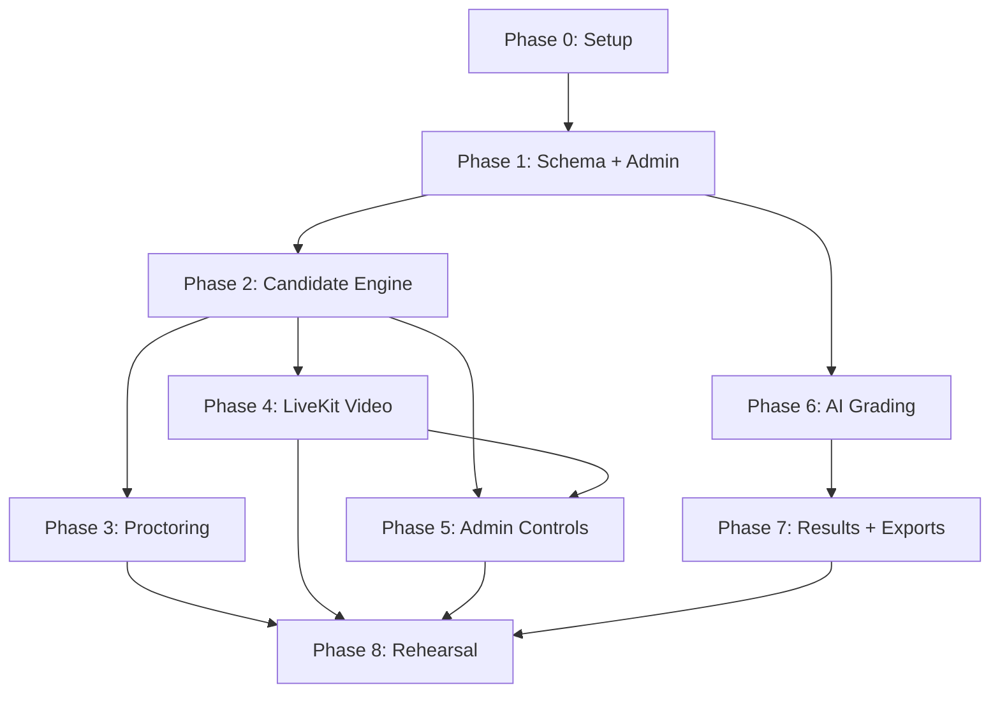

# Implementation Plan — Exam Platform

Detailed task breakdown for each phase. Tasks are ordered by dependency within each phase.

> [!IMPORTANT]
> This plan incorporates all fixes from `Issues.md` (rounds 1–5). Changes are marked with 🔧 (fix) or ➕ (new task).
> Round 2: 🔧². Round 3: 🔧³. Round 4: 🔧⁴. Round 5: 🔧⁵.

---

## Phase 0 — Setup (0.5–1 day)

**Dependencies:** none

### Tasks

| # | Task | Files | Details |
|---|---|---|---|
| 0.1 | Initialize Next.js + TypeScript | `apps/web/` | `npx create-next-app@latest` with App Router, TypeScript, ESLint |
| 0.2 | Install core dependencies | `package.json` | `@supabase/supabase-js`, `@supabase/ssr`, `iron-session`, 🔧 `sanitize-html` (replaces `dompurify` — needs browser DOM on server), `@node-rs/argon2` |
| 0.3 | Supabase project setup | Supabase dashboard | Create project, note URL + anon key + service role key |
| 0.4 | Environment config | `.env.local`, `.env.example` | All variables from §14.1; `.env.example` with placeholder values for team reference. 🔧² **Include `ALERT_WEBHOOK_URL`** (Telegram/Discord) |
| 0.5 | Supabase client helpers | `lib/supabase/server.ts`, `lib/supabase/client.ts` | Server client (service role), browser client (anon key for admin Realtime only) |
| 0.6 | iron-session config | `lib/session.ts` | Session options with `secure: process.env.NODE_ENV === 'production'`, cookie name, TTL = exam duration + 2 hours |
| 0.7 | Vercel project | Vercel dashboard | Connect repo, set env vars, confirm auto-deploy |
| 0.8 | Git repo + structure | root | Create folder structure from §14.6; initial commit |
| ➕ 0.9 | Logger config | `lib/logger.ts` | 🔧 Configure logger to **never log request bodies** — NIC/ID data must not appear in logs |
| ➕ 0.10 | Public health endpoint | `app/api/health/route.ts` | 🔧 Simple public endpoint for UptimeRobot to ping (also prevents Supabase free-tier pausing) |

**Done when:** deployed app reads a row from Supabase and iron-session creates a test cookie on localhost.

---

## Phase 1 — Schema, Admin Auth, Candidates, Questions (2–3 days)

**Dependencies:** Phase 0

### 1A — Database (0.5 day)

| # | Task | Files |
|---|---|---|
| 1A.1 | Write migration SQL | `supabase/migrations/001_initial.sql` | 🔧³ **Write this as one consolidated migration** — the new columns are scattered across task rows in this plan, and writing them piecemeal is error-prone. Author the full final SQL once from the task descriptions below |
| 1A.2 | Run migration | Supabase dashboard or CLI |
| 1A.3 | Enable RLS on all tables | Same migration |
| 1A.4 | RLS policy: admin full access | Same migration |
| 1A.5 | Enable Realtime | `attempts`, `violation_events`, `grading_jobs`, `grading_log`, `alerts` |
| 1A.6 | Create `snapshots` private bucket | Supabase Storage |
| 1A.7 | Seed super admin + admin users | `supabase/seed.sql` or manual |
| ➕ 1A.8 | Schema: `exams.ends_at` + `exams.force_ended_at` | Same migration | 🔧 `ends_at` timestamptz — set when exam goes live, add to on extend, set to `now()` on force-end. 🔧³ **Add `force_ended_at`** timestamptz (null unless force-ended). Keep status CHECK as `draft/scheduled/live/ended/finalized` — do NOT add `force_ended` as a status value (the CHECK constraint would reject it). Force-end is detected by `force_ended_at IS NOT NULL` |
| ➕ 1A.9 | Schema: `question_scores` table | Same migration | 🔧 `(attempt_id, question_id, source, marks, max_marks, reason, note,` 🔧² `created_at,` 🔧³ `details, needs_review)` — `details` is JSONB storing `{matched_points, missing_points, confidence, candidate_meaning_english, incorrect_claims}` (the review screen needs these; `reason`+`note` alone aren't enough). `needs_review` is boolean. Source is `mcq`, `ai`, or `override`. PDF and review screen read from a **`current_scores` view** (see 1A.17); `results` becomes just totals |
| ➕ 1A.10 | Schema: `answers.revision` + `answers.flagged` | Same migration | 🔧 `revision` integer column. Client increments per question per save. Server accepts only higher revisions (replaces `updated_at` clock-based conflict check). 🔧⁴ **Add `flagged` boolean** (default false). Candidate can flag a question for later review in free mode. The question list (2D.8) shows flagged indicators |
| ➕ 1A.11 | Schema: `attempt_questions.option_order` | Same migration | 🔧 JSONB column storing shuffled option order per question. Survives reconnect |
| ➕ 1A.12 | Schema: `login_attempts.success` | Same migration | 🔧 Boolean column. Rate limiting counts only `success = false` rows |
| ➕ 1A.13 | Schema: `system_health` table | Same migration | 🔧 Worker heartbeat writes here (not to `alerts`). Columns: `component`, `last_heartbeat_at`, `status` |
| ➕ 1A.14 | Schema: alert dedup | Same migration | 🔧🔧² Add `unique_key` column. Use a **partial unique index**: `CREATE UNIQUE INDEX ON alerts (unique_key) WHERE resolved_at IS NULL` — a `UNIQUE(unique_key, resolved_at IS NULL)` constraint is invalid SQL and will fail the migration |
| ➕ 1A.15 | DB function: `generate_paper()` | Same migration | 🔧 Atomically selects random subset, saves to `attempt_questions` with option order, using `SELECT ... FOR UPDATE` on the attempt row to prevent race conditions on double-refresh |
| 1A.16 | Indexes | Same migration | `attempts(exam_id, status)`, `answers(attempt_id)`, `violation_events(attempt_id)`, `grading_jobs(run_id, status)`, `sessions(candidate_id, revoked_at)`, `attempt_questions(attempt_id)` |
| ➕ 1A.17 | DB view: `current_scores` | Same migration | 🔧² View over `question_scores` returning the "current" score per (attempt, question). **Rule: if an `override` row exists, it always wins; otherwise the latest `created_at` wins.** Results calculator and review screen read from this view, never raw `question_scores` |
| ➕ 1A.18 | Schema: `exams.navigation_mode` | Same migration | 🔧³ Enum or text CHECK `('sequential', 'free')`, default `'free'`. Sequential = next-only, no going back. Free = full paper with question list |
| ➕ 1A.19 | Schema: `attempts.current_position` | Same migration | 🔧³ Integer, default 0. Tracks the candidate's current question index in sequential mode. Indexes into the saved `attempt_questions` order |
| ➕ 1A.20 | Schema: `attempts.submit_reason` | Same migration | 🔧³ Text CHECK `('manual', 'auto', 'forced')`. Keep attempt status as `not_started/acknowledged/in_progress/submitted/finalized` (do NOT add `force_submitted`). The reason for submission is recorded here instead |

### 1B — Admin Auth + Layout (0.5 day)

| # | Task | Files |
|---|---|---|
| 1B.1 | Admin login page | `app/(admin)/admin/login/page.tsx` |
| 1B.2 | Auth middleware | `middleware.ts` or layout-level check |
| 1B.3 | Admin layout with sidebar | `app/(admin)/admin/layout.tsx` |
| 1B.4 | Role-based access helper | `lib/auth.ts` — `requireAdmin()`, `requireSuperAdmin()` |
| 🔧 1B.5 | Auth in route handlers | All admin API routes | 🔧 Call `requireAdmin()` **inside every admin route handler**, not only in middleware. Defense in depth against Next.js middleware bypass |

### 1C — Candidates (0.5 day)

| # | Task | Files |
|---|---|---|
| 1C.1 | NIC hashing utility | `lib/hashing.ts` — 🔧 **normalize before hashing**: trim whitespace, uppercase, convert old NIC format (9-digit + V/X) ↔ new format (12-digit). Use `@node-rs/argon2` (native `argon2` breaks on Vercel) + pepper |
| 1C.2 | Candidate list page | `app/(admin)/admin/candidates/page.tsx` |
| 1C.3 | Add/edit candidate form | `app/(admin)/admin/candidates/[id]/page.tsx` |
| 1C.4 | CSV import | `app/api/admin/candidates/import/route.ts` |
| 1C.5 | Candidate API routes | `app/api/admin/candidates/route.ts` |

### 1D — Exams (0.5 day)

| # | Task | Files |
|---|---|---|
| 1D.1 | Exam list page | `app/(admin)/admin/exams/page.tsx` |
| 1D.2 | Create/edit exam form | `app/(admin)/admin/exams/[id]/page.tsx` — includes `questions_per_paper`, `shuffle`, `flag_threshold`, schedule. 🔧 **Convert Colombo time input to UTC** before storing. 🔧³ **Add `navigation_mode` toggle** (sequential / free). Locked once exam is live — changing mode mid-exam would break candidates' progress |
| 1D.3 | Assign candidates to exam | Same page or sub-page |
| 1D.4 | Exam API routes | `app/api/admin/exams/route.ts` |

### 1E — Question Builder (1 day)

| # | Task | Files |
|---|---|---|
| 1E.1 | Install Tiptap | `package.json` — `@tiptap/react`, `@tiptap/starter-kit`, extensions |
| 1E.2 | Tiptap editor component | `components/editor/TiptapEditor.tsx` |
| 1E.3 | Question builder page | `app/(admin)/admin/exams/[id]/questions/page.tsx` |
| 1E.4 | MCQ option editor | `components/editor/McqOptions.tsx` — add/remove options, mark correct |
| 1E.5 | Written answer fields | Model answer, grading notes, calibration examples |
| 1E.6 | Drag-and-drop ordering | Question position reordering |
| 1E.7 | Question API routes | `app/api/admin/questions/route.ts`, `app/api/admin/answer-keys/route.ts` |
| 1E.8 | Server-side HTML sanitization | 🔧 Use `sanitize-html` (not `dompurify`) — sanitize all HTML before DB write |

**Done when:** an admin builds an exam with 40 questions (mixed MCQ + written), sets `questions_per_paper = 20`, assigns 23 candidates.

---

## Phase 2 — Candidate Login and Exam Engine (3–4 days)

**Dependencies:** Phase 1

### 2A — Candidate Auth (0.5 day)

| # | Task | Files |
|---|---|---|
| 2A.1 | Login page | `app/(candidate)/login/page.tsx` — MER code + NIC input. 🔧 **Show which exam** the candidate is joining if multiple exist |
| 2A.2 | Login API | `app/api/auth/login/route.ts` — 🔧 Normalize NIC → hash → verify; check `login_attempts` rate limit (**failed only**); 🔧 **check candidate is assigned to the exam**; create iron-session; revoke older sessions |
| 2A.3 | Rate limit check | Query `login_attempts` for count of 🔧 **`success = false`** in last 10 min per MER and per IP |
| 2A.4 | Session middleware | `lib/session.ts` — `getSession()` helper for candidate routes. 🔧 **Check session ID against `sessions.revoked_at`** on every candidate API call (not just at login) — makes session revocation actually enforced |
| 2A.5 | Confirmation page | `app/(candidate)/confirm/page.tsx` — 🔧⁵ show name and outlet **(no photo)**, acknowledge button |
| 2A.6 | Acknowledge API | `app/api/auth/acknowledge/route.ts` |

### 2B — Waiting Room + Broadcast (0.5 day)

| # | Task | Files |
|---|---|---|
| 2B.1 | Broadcast channel hook | `lib/broadcast.ts` — subscribe to `exam:{examId}` channel |
| 2B.2 | Broadcast publish helper | `lib/broadcast-server.ts` — server-side publish for admin actions |
| 2B.3 | Waiting room page | `app/(candidate)/waiting/page.tsx` — countdown, camera preview, Broadcast listener. 🔧 **Enforce fullscreen here too** with blocking overlay (fullscreen needs a user click; if they leave it while waiting, exam start can't re-enter automatically). 🔧² **Add 5–10 second interval poll** of exam state API as fallback — if Wi-Fi blips at the exact start moment, the Broadcast `exam_started` message is missed and the candidate sits in the waiting room while the exam runs. Also refetch state on Broadcast reconnect |
| 2B.4 | Time sync | `app/api/time/route.ts` + `lib/time.ts` — server clock offset calculation |
| 2B.5 | Exam state API (fallback) | `app/api/exam/state/route.ts` — fallback if Broadcast missed. 🔧² This is the endpoint the waiting room polls every 5–10s |
| ➕ 2B.6 | Consent / rules screen | `app/(candidate)/rules/page.tsx` | 🔧 Display: camera and audio are monitored live, snapshots are stored, and when they'll be deleted. 🔧² **Include specific deletion timeframe**. 🔧³ **State which navigation mode applies** (sequential or free). 🔧⁵ **Include candidate setup instructions**: Laptops — use a Chrome Guest window, no second screen, camera and mic on. Tablets — Chrome only, "Desktop site" off, run the pre-exam check the day before (for first-time OS camera permissions). These instructions currently live only in the old main plan. Must be acknowledged before proceeding |

### 2C — Paper Delivery + Question Pool (0.5 day)

| # | Task | Files |
|---|---|---|
| 2C.1 | Paper API | `app/api/exam/paper/route.ts` | 🔧³ **Mode-aware**: in `free` mode, return all questions. In `sequential` mode, return **only the current question** (by `current_position`) plus the total count ("Question 7 of 20"). Sending the whole paper in sequential mode would let candidates read ahead via browser dev tools |
| 2C.2 | Question pool selection | 🔧 **Call `generate_paper()` DB function** (locked, atomic). If `attempt_questions` already exists, return saved set with saved `option_order`. No double-refresh race condition |
| 2C.3 | Shuffle logic | If `shuffle` enabled: shuffle question subset + shuffle options per question → save both `position` and `option_order` to `attempt_questions` |

### 2D — Exam UI (1 day)

| # | Task | Files |
|---|---|---|
| 2D.1 | Exam page layout | `app/(candidate)/exam/page.tsx` — timer, save indicator. 🔧² **All candidate page transitions must be client-side navigation** (`router.push` / `<Link>`), never full page loads — a full reload kills fullscreen and the LiveKit connection. 🔧³ **Two layout modes**: free mode shows a question list sidebar (answered/unanswered indicators, Previous/Next, summary screen before submit); sequential mode shows one question at a time with a Next button only. 🔧³ **Block browser Back button** (`history.pushState` loop or `beforeunload`) so it doesn't leave the exam page. 🔧⁴ **Set `overscroll-behavior: none`** on the exam page — pull-to-refresh on Android reloads the page, exits fullscreen, and drops the camera. 🔧⁴ **Use `100dvh`** (not `100vh`) for layouts — on Android the on-screen keyboard resizes the viewport; `dvh` keeps the timer/Next/Submit button visible above it |
| 2D.2 | Question renderer | `components/exam/QuestionCard.tsx` — renders HTML body, MCQ radios 🔧 **using saved `option_order`**, written textarea |
| 2D.3 | Timer component | `components/exam/Timer.tsx` — server-synced with offset. 🔧 Deadline = `exams.ends_at + attempts.extra_minutes` |
| 2D.4 | Save indicator | `components/exam/SaveIndicator.tsx` — green/yellow/orange states |
| 2D.5 | MCQ answer handler | Radio button selection → state |
| 2D.6 | Written answer handler | Textarea with Unicode Sinhala support. 🔧⁴ **Disable `autocorrect`, `autocomplete`, and `spellcheck`** on the answer textarea. Never rely on `keydown` events (Android keyboards report generic key codes) — use `input` events instead |
| ➕ 2D.7 | Sequential mode Next button | 🔧³ `components/exam/NextButton.tsx` — warns when answer is blank ("You can't come back to this question"). On the last question, button becomes "Submit Exam". Waits for server confirmation before advancing; if connection is down, shows "Reconnecting…" instead of advancing. IndexedDB still protects the text locally. 🔧⁴ **Debounce / disable on click** to prevent double-taps (see 2F.6 for server-side idempotency) |
| ➕ 2D.8 | Free mode question list | 🔧³ `components/exam/QuestionList.tsx` — sidebar listing all questions with answered/unanswered/🔧⁴ **flagged** indicators (reads `answers.flagged`). Click to jump to any question. 🔧⁴ **Flag toggle button** on each question. Summary screen before final submit shows unanswered and flagged questions |
| ➕ 2D.9 | Touch layout | 🔧⁴ `styles/tablet.css` or responsive rules — **768–1024px widths** in both orientations. Minimum **44px touch targets** on all interactive elements. No hover-only controls. Ensure question list sidebar is usable on tablet portrait |

### 2E — Autosave + Offline (0.5 day)

| # | Task | Files |
|---|---|---|
| 2E.1 | IndexedDB helper | `lib/indexeddb.ts` — save/load/queue operations |
| 2E.2 | Autosave hook | `hooks/useAutosave.ts` — debounce 1s, periodic 10s, IndexedDB write, server upsert. 🔧 **Increment `revision` integer per question per save** (client-side counter) |
| 2E.3 | Retry queue | Failed saves queued and retried; indicator updates |
| 2E.4 | Answers API | `app/api/answers/route.ts` — upsert with 🔧 **`revision` conflict check** (accept only higher revision, not `updated_at`), reject after deadline + 🔧 **15 seconds** (was 5s — too tight on slow networks). 🔧² **Also check attempt status and exam status**: 🔧⁴ use `status IN ('submitted','finalized')` as the single submitted check (not `submit_reason IS NOT NULL` — `submit_reason` is for the reason only); also check exam `force_ended_at IS NOT NULL`. 🔧³🔧⁴ **Sequential mode position guard**: reject saves for any question **other than** `current_position` (not just earlier ones — future saves are also invalid) |

### 2F — Submit + Reconnect (0.5 day)

| # | Task | Files |
|---|---|---|
| 2F.1 | Submit API | `app/api/exam/submit/route.ts` — final flush, mark submitted. 🔧³ Set `submit_reason = 'manual'` |
| 🔧² 2F.2 | Manual submit + auto-submit | 🔧² **Manual "Submit Exam" button with confirm dialog** ("Are you sure? You cannot change your answers after submitting."). In sequential mode, the last question's Next button becomes this Submit button. Auto-submit on deadline: 🔧 **lock UI at deadline** (disable all inputs), flush answers within 15s grace, call submit with 🔧³ `submit_reason = 'auto'` |
| 2F.3 | Done page | `app/(candidate)/done/page.tsx` — "Submitted" confirmation |
| 2F.4 | Reconnect flow | Login with same MER + ID → load existing attempt, saved answers, same question subset 🔧 **with same option order**, remaining time. 🔧³ **In sequential mode, resume at `current_position`** (not question 1). The paper API returns only that question |
| 2F.5 | Worker scheduler | `worker/src/scheduler.ts` — 30s loop: move scheduled→live exams (🔧 set `exams.ends_at`). 🔧²🔧³🔧⁴ **Exam state transitions (revised again)**: force-submit uses **each attempt's own deadline** (`ends_at + extra_minutes + 15s`), NOT the global `ends_at + 15s` — the previous version would cut off candidates who were given extra time. Mark the exam `ended` only after the **last** attempt's deadline passes. Then mark `finalized`. The grading guard (6D.1) depends on `finalized` status |
| ➕ 2F.6 | Next question API | 🔧³ `app/api/exam/next/route.ts` — **Sequential mode only**. Atomic operation: saves the current answer + increments `current_position`. Returns the next question. Rejects if position is already at end. 🔧⁴ **Idempotency guard**: client sends `expected_position` with every call; server advances only if `current_position == expected_position`. If the server already advanced (reply was lost), it returns the current question without advancing again — prevents double-tap from skipping a question |

**Done when:** a test candidate gets 20 random questions from 40, answers some, disconnects, reconnects and sees the same 20 questions with saved answers and same shuffled option order, and gets auto-submitted at deadline. In sequential mode, reconnect resumes at the correct position and earlier questions can't be re-answered.

---

## Phase 3 — Proctoring and Logs (2–3 days)

**Dependencies:** Phase 2

### 3A — Proctoring Events (1 day)

| # | Task | Files |
|---|---|---|
| 3A.1 | Proctoring hook | `hooks/useProctoring.ts` — attaches all event listeners. 🔧 **Includes incident dedup logic**: merge events within ~3 seconds into one incident (e.g., FULLSCREEN_EXIT + FOCUS_LOST + VIEWPORT_CHANGED from one alt-tab = 1 incident, not 3 violations) |
| 3A.2 | Visibility change handler | `visibilitychange` → `TAB_HIDDEN` |
| 3A.3 | Focus handler | `window blur` + 1s `document.hasFocus()` check → `FOCUS_LOST` |
| 3A.4 | Fullscreen handler | `fullscreenchange` → `FULLSCREEN_EXIT` + blocking overlay. 🔧⁴🔧⁵ **Lock orientation** after entering fullscreen — lock to **the orientation the candidate is already in** (`screen.orientation.lock(screen.orientation.type)` on Android — only works in fullscreen). Do NOT hardcode `'portrait'` — tablets are often held in landscape and forcing portrait would cause an unwanted rotation. Unlock orientation when fullscreen ends |
| 3A.5 | Viewport check | 🔧 **Only run while in fullscreen**. 1s interval: `innerWidth` vs `screen.width` → `VIEWPORT_CHANGED` (width-only on Android). 🔧⁴ **"Desktop site" mode** makes the viewport report a wider width — the pre-exam check (5B) should detect and warn about this |
| 3A.6 | Multi-screen check | 🔧⁴ **Guard `screen.isExtended`** — it doesn't exist on Android, so check `'isExtended' in screen` before reading it. `MULTI_SCREEN` only on desktop |
| 3A.7 | Camera/mic loss handler | MediaStreamTrack `ended`/`mute` → `CAMERA_LOST` / `MIC_LOST` |
| 3A.8 | Copy/paste/context menu | Block and log `COPY`, `PASTE`, `CONTEXT_MENU` |
| 3A.9 | Reload detection | On page load during in-progress attempt → `RELOAD` |
| 3A.10 | Fullscreen overlay | `components/exam/FullscreenOverlay.tsx` — blocking until restored |
| ➕ 3A.11 | Snapshot rate-limiting | 🔧 Max 1 snapshot per incident (merged window). Frame captured while tab is hidden may be frozen/black — skip or mark as such |

### 3B — Event Logging (0.5 day)

| # | Task | Files |
|---|---|---|
| 3B.1 | Events API | `app/api/events/route.ts` — accept event + optional snapshot |
| 3B.2 | Snapshot capture | `lib/snapshot.ts` — capture 320x240 JPEG from video element |
| 3B.3 | Snapshot upload | Upload to Supabase Storage `snapshots` bucket |
| 3B.4 | Heartbeat API | `app/api/heartbeat/route.ts` — update `last_seen_at` |
| 3B.5 | Heartbeat hook | `hooks/useHeartbeat.ts` — POST every 10s |

### 3C — Admin Violation View (0.5 day)

| # | Task | Files |
|---|---|---|
| 3C.1 | Violation timeline | `components/admin/ViolationTimeline.tsx` — per candidate, all events with snapshots |
| 3C.2 | Violation count badges | `components/admin/CandidateBadge.tsx` — 🔧 count **incidents** (not raw events) + red threshold |
| 3C.3 | Realtime violation updates | Subscribe to `violation_events` Realtime changes |

**Done when:** every event type in §8.1 appears in the admin log with a snapshot, including split view and side panel cases. Alt-tabbing counts as 1 incident, not 3.

---

## Phase 4 — Live Video and Audio (2–3 days)

**Dependencies:** Phase 2 (candidate auth and exam engine must work)

### 4A — LiveKit Cloud Setup (0.5 day)

| # | Task | Files |
|---|---|---|
| 4A.1 | Install LiveKit SDK | `package.json` — `livekit-client`, `@livekit/components-react` |
| 4A.2 | LiveKit Cloud account | Create free account, get API key + secret |
| 4A.3 | Token generation | `app/api/livekit/token/route.ts` — candidate (publish-only) + admin (subscribe-only, hidden) |

### 4B — Candidate Publishing (0.5 day)

| # | Task | Files |
|---|---|---|
| 4B.1 | Camera/mic hook | `hooks/useLiveKit.ts` — connect, publish camera at 320x240 + mic. 🔧⁴🔧⁵ **Cap Android camera**: `frameRate: { ideal: 15, max: 15 }` (4 GB tablets struggle at higher rates). Detect Android via UA. **Laptops stay at 30 fps**. Tune the Android value in the tablet rehearsal (8.27) |
| 🔧 4B.2 | LiveKit layout provider | `app/(candidate)/layout.tsx` | 🔧 **Put LiveKit connection in a layout-level provider** inside the `(candidate)` route group. This keeps the camera alive across waiting room → exam → done without reconnecting. Route groups with separate root layouts trigger full page reload, which kills fullscreen |
| 4B.3 | Integrate into waiting room + exam | Both pages consume the layout-level LiveKit context |
| 4B.4 | Degradation banner | `components/exam/CameraBanner.tsx` — 🔧 **"Camera disconnected. Please reconnect. Your exam continues and this is logged."** (not "marks may be reduced" — if EC2 goes down, candidates shouldn't panic over something that isn't their fault). State any penalty policy on the rules screen instead |

### 4C — Admin Grid (1 day)

| # | Task | Files |
|---|---|---|
| 4C.1 | Live grid page | `app/(admin)/admin/live/page.tsx` |
| 4C.2 | Video tile component | `components/admin/VideoTile.tsx` — MER label, name, status badge, violation count, speaker button. 🔧³ **Progress label**: show "Q 7/20" (sequential) or "14 answered" (free) per candidate |
| 4C.3 | Manual subscription | Subscribe to all video tracks; audio only when speaker toggled on |
| 4C.4 | Tile enlarge | Click tile to enlarge + show violation timeline |
| 4C.5 | Status badges | Not joined, Ready, In exam, Offline, Submitted, Camera Off |

### 4D — Self-hosted LiveKit on EC2 (1 day)

| # | Task | Files |
|---|---|---|
| 4D.1 | EC2 setup | Ubuntu, Docker, Elastic IP |
| 4D.2 | DuckDNS setup | Free subdomain pointing to Elastic IP. 🔧² **LiveKit's config generator may ask for a second hostname for TURN** (Caddy on 443). Check whether DuckDNS supports sub-subdomains (e.g. `turn.examlk.duckdns.org`) — if not, register a second DuckDNS subdomain (e.g. `examlk-turn.duckdns.org`) |
| 4D.3 | LiveKit Docker Compose | `infra/livekit/docker-compose.yml` — LiveKit server, Caddy, Redis |
| 4D.4 | Caddy config | `infra/livekit/Caddyfile` — HTTPS with DuckDNS + Let's Encrypt. 🔧² Include the TURN hostname if a second one is needed |
| 4D.5 | Security group | 🔧 **TCP 80** (for Let's Encrypt cert issuance), TCP 443, 7881; UDP 3478, 50000–60000; SSH restricted. Follow LiveKit's generated port list |
| 4D.6 | Swap file | 2 GB swap |
| 4D.7 | Switch `LIVEKIT_URL` | Point to self-hosted instance |
| 4D.8 | Load test | Test with 🔧 **23 simulated publishers** using LiveKit's load-test tool; monitor CPU and bandwidth |

**Done when:** grid stays smooth with test tiles; any candidate can be heard on demand; LiveKit disconnect shows the warning without blocking the exam.

---

## Phase 5 — Admin Controls, Pre-exam Check, Super Admin (1–2 days)

**Dependencies:** Phase 2 (exam engine), Phase 4 (LiveKit for pre-exam check)

### 5A — Admin Controls (0.5 day)

| # | Task | Files |
|---|---|---|
| 5A.1 | Start now API | `app/api/admin/exams/[id]/start/route.ts` — set `started_at`, 🔧 **set `ends_at = now() + duration_min`**, publish Broadcast `exam_started` |
| 5A.2 | Extend API | `app/api/admin/exams/[id]/extend/route.ts` — all or one; 🔧 **add minutes to `exams.ends_at`** (or `attempts.extra_minutes` for individual); publish time update |
| 5A.3 | Force-end API | `app/api/admin/exams/[id]/force-end/route.ts` — 🔧 **set `exams.ends_at = now()`**; 🔧³ **set `force_ended_at = now()`** (keep status as `ended`, not a new value — the CHECK constraint only allows `draft/scheduled/live/ended/finalized`); submit all attempts with `submit_reason = 'forced'`; publish `exam_ended` |
| 5A.4 | Force-submit + kick | `app/api/admin/attempts/[id]/force-submit/route.ts`, `/kick/route.ts` |
| 5A.5 | Broadcast API | `app/api/admin/exams/[id]/broadcast/route.ts` — save to `broadcasts`, publish to channel |
| 5A.6 | Admin action logging | Write all actions to `admin_actions` |
| 5A.7 | Exam edit restrictions | UI disables fields based on exam status (draft/scheduled: full edit; live: extend/force-end only) |

### 5B — Pre-exam Check (0.5 day)

| # | Task | Files |
|---|---|---|
| 5B.1 | Pre-exam check page | `app/(candidate)/check/page.tsx` |
| 5B.2 | Chrome check | 🔧⁴ `navigator.userAgentData.brands` check — **fall back to `navigator.userAgent` string** on older Chrome where `userAgentData` is undefined |
| 5B.3 | Camera preview | Show video feed, confirm working |
| 5B.4 | Mic level | Show mic input level indicator |
| 5B.5 | Fullscreen test | Request fullscreen, confirm it works |
| 5B.6 | Network check | Test API connectivity |
| 5B.7 | Monitor check | `screen.isExtended` warning (🔧⁴ guarded — skip on Android where it doesn't exist) |
| 5B.8 | Wake Lock | Request Screen Wake Lock. 🔧⁴ **Re-request wake lock on `visibilitychange`** — wake lock is released whenever the page is hidden (e.g. notification shade on Android), so re-acquire it when the page becomes visible again |
| 🔧⁴🔧⁵ 5B.10 | Desktop site check | 🔧⁴🔧⁵ On Android, detect "Desktop site" mode: after entering fullscreen, if `window.innerWidth > screen.width`, or the UA contains no `"Android"` on a touch-capable device (`'ontouchstart' in window && !navigator.userAgent.includes('Android')`), **block the check and show a message** asking the candidate to turn "Desktop site" off, then retry. Without this, viewport checks will misfire throughout the exam |
| 🔧 5B.9 | All permission prompts here | 🔧 **All browser permission prompts (camera, mic, fullscreen, wake lock) must happen in this pre-exam check page only**. Permission prompts and Android system dialogs cause blur events that would trigger false violations during the exam |

### 5C — Super Admin (0.5 day)

| # | Task | Files |
|---|---|---|
| 5C.1 | Health check page | `app/(admin)/admin/health/page.tsx` |
| 5C.2 | Health API | `app/api/admin/health/route.ts` — check Supabase, LiveKit, 🔧 Gemini keys **via key-listing endpoint** (not a test generation call — don't burn quota), worker heartbeat **from `system_health` table** |
| 5C.3 | Alerts display | Show active alerts from `alerts` table via Realtime |
| 5C.4 | Resolve alert API | `app/api/admin/alerts/[id]/resolve/route.ts` |
| ➕ 5C.5 | UptimeRobot setup | 🔧 Configure free UptimeRobot monitor pinging the public health endpoint (0.10). Prevents Supabase free-tier pausing |

**Done when:** Start now triggers Broadcast and sets `ends_at`; extend/force-end update `ends_at`; pre-exam check validates all requirements with all permission prompts; health page shows all-green status.

---

## Phase 6 — AI Grading (3–4 days)

**Dependencies:** Phase 1 (schema), Phase 2 (attempts and answers must exist)

### 6A — Worker Core (1 day)

| # | Task | Files |
|---|---|---|
| 6A.1 | Worker entry point | `worker/src/index.ts` — main loop |
| 6A.2 | Key manager | `worker/src/keys.ts` — pick active key, handle cooldown/disabled states |
| 6A.3 | Key state table init | Seed `api_key_state` with key1, key2, key3 |
| 6A.4 | Job picker | `worker/src/grader.ts` — pick pending job, lock, process |
| 6A.5 | Stuck job reset | Reset jobs stuck in 'running' for >2 min |
| 6A.6 | Health heartbeat | 🔧 Write timestamp to **`system_health`** table every 30s (not `alerts`) |
| ➕ 6A.7 | Alert webhook | `worker/src/alerts.ts` | 🔧 Send critical alerts via **Telegram or Discord webhook** (alerts table alone only shows on a page you might not be watching during the exam) |
| ➕ 6A.8 | Quota pre-check | 🔧🔧² ~~Check Gemini quota via API~~ — **Gemini has no API to read remaining quota**. Instead: send a **dry-run generation call** with a tiny prompt to verify the key works; log the result. For actual quota numbers, **manually check AI Studio** before starting the grading run. The real protection is the failover code (6B.4), not this check |

### 6B — Gemini Integration (1 day)

| # | Task | Files |
|---|---|---|
| 6B.1 | Prompt builder | `worker/src/prompt.ts` — system instruction + user message from §12.2. 🔧² One grading job per candidate. 🔧³ **Cap at ~10 questions per Gemini call** — one call with all 20 answers lets a single bad or injected answer affect grading of the rest. Split into chunks of ≤10. `grading_jobs` keyed by `(run_id, attempt_id)` with 🔧³ **`question_ids` scope column** (JSONB array of question IDs this job covers). A full grading run creates 2–3 jobs per candidate; a single-question regrade creates one job with `question_ids = [that_id]` — no key collision. Response JSON schema: array of `{question_id, marks, reason, matched_points, missing_points, confidence, candidate_meaning_english, incorrect_claims}` |
| 6B.2 | Gemini API caller | `worker/src/gemini.ts` — call with JSON schema, temperature 0 |
| 6B.3 | Response parser | Validate JSON, clamp marks to 0..max. 🔧 **Write results to `question_scores` table** (per-question, with source = `ai`). 🔧³ Store full AI response in `details` jsonb; set `needs_review` boolean based on confidence threshold |
| 6B.4 | Error handling | 🔧 **Parse 429 error details** to distinguish rate-limit (short cooldown) from daily quota exhaustion (long wait or switch key). 400/403 → disabled + alert; 5xx → retry with backoff; bad JSON → retry once |
| 6B.5 | Logging | Write every event to `grading_log` |

### 6C — MCQ Scoring + Results (0.5 day)

| # | Task | Files |
|---|---|---|
| 6C.1 | MCQ scorer | Code-based: compare `selected_option_id` with `answer_keys.correct_option_id`. 🔧 **Write to `question_scores`** with source = `mcq` |
| 6C.2 | Results calculator | `total_marks` = sum from 🔧² **`current_scores` view** for candidate's assigned questions; `total_percent` = `(mcq + written) / total * 100` |
| 6C.3 | Results write | Upsert into `results` table (totals only — detail is in `question_scores`, read via `current_scores` view) |

### 6D — Grading API + Admin UI (1 day)

| # | Task | Files |
|---|---|---|
| 6D.1 | Start grading API | `app/api/admin/exams/[id]/grade/route.ts` — 🔧 **Guard: only after exam is finalized** (all attempts submitted/expired). Create `grading_runs` + `grading_jobs`. 🔧 **Skip empty answers** — score them 0 in code, create jobs only for non-empty written answers |
| 6D.2 | Resume API | `app/api/admin/grading/[run]/resume/route.ts` |
| 6D.3 | Grading progress page | `app/(admin)/admin/results/page.tsx` — progress bar, key states, log |
| 6D.4 | Review screen | `app/(admin)/admin/results/[attempt]/page.tsx` — per-question: candidate answer, model answer, AI marks, reason, matched/missing points, confidence, 🔧³ **`candidate_meaning_english`** (how admins verify Singlish answers). 🔧 **Reads from `current_scores` view**. All detail fields come from `question_scores.details` jsonb |
| 6D.5 | Override API | `app/api/admin/results/[attempt]/override/route.ts` — 🔧 **Writes to `question_scores`** with source = `override`. 🔧² Override rows are never replaced by regrading (the view guarantees this) |
| 6D.6 | Regrade API | Regrade single question → new grading job with 🔧³ `question_ids = [that_id]` (no key collision with full-run jobs). 🔧² **"Current" rule**: override always wins; if no override, latest `created_at` wins. Enforced by the `current_scores` view (1A.17). Recalculate `results` totals after regrade completes |

### 6E — Prompt Testing (0.5 day)

| # | Task | Files |
|---|---|---|
| 6E.1 | Test script | `worker/scripts/test-prompt.ts` — run prompt on sample answers |
| 6E.2 | Test with Singlish/Sinhala | 10–15 sample answers including mixed language |
| 6E.3 | Calibration tuning | Adjust grading notes and calibration examples based on results |

**Done when:** full 23-paper run completes; one key deliberately broken → worker fails over and alerts super admin via webhook; MCQ + written scores calculated correctly in `question_scores`.

---

## Phase 7 — Results and Exports (1–2 days)

**Dependencies:** Phase 6

### Tasks

| # | Task | Files |
|---|---|---|
| 7.1 | Results summary page | `app/(admin)/admin/results/summary/page.tsx` — all 23 candidates, total scores |
| 7.2 | ~~Per-candidate detail page~~ | 🔧 **Removed** — duplicate of 6D.4 (`results/[attempt]/page.tsx`) |
| 7.3 | Print/PDF page | `app/(admin)/admin/results/[attempt]/print/page.tsx` — print-styled, Noto Sans Sinhala, optional examiner answers. 🔧 **Reads from `question_scores`** |
| 7.4 | Summary CSV export | `app/api/admin/results/export/route.ts` — all scores + which questions each candidate received |
| 7.5 | Question subset indicator | Show which questions each candidate got (if pool used) |
| ➕ 7.6 | Post-exam backup export | 🔧 Export results and PDFs. Copy to Google Drive immediately after the exam (free Supabase projects don't have reliable backups) |
| ➕ 7.7 | Snapshot deletion | 🔧² The rules/consent screen promises snapshots will be deleted after a specific time. **Add a task that actually deletes them** — either a worker cron job that purges snapshots older than the stated retention period, or an admin button on the health page to trigger deletion manually. Without this, the consent promise is broken |

**Done when:** PDF exports correctly with Sinhala text; CSV contains all scores and question assignments; backup exported.

---

## Phase 8 — Rehearsal and Hardening (2 days)

**Dependencies:** All previous phases

### Tasks

| # | Task | Details |
|---|---|---|
| 8.1 | Create practice exam | Flag `is_practice`, add 10 dummy questions |
| 8.2 | Rehearsal with 3–5 people | Real laptops + Android tabs |
| 8.3 | Test split view | Chrome split view, Windows Snap, side panel |
| 8.4 | Test Android split-screen | Split-screen mode, floating window |
| 8.5 | Test network drop | Disconnect for 2 min, reconnect |
| 8.6 | Test LiveKit disconnect | Kill LiveKit → warning banner, exam continues |
| 8.7 | Test multi-login | Same MER in two browsers |
| 8.8 | Test question pool | Verify different candidates get different subsets; verify reconnect gets same subset 🔧 **with same option order** |
| 8.9 | Test auto-submit | Deadline reached → auto-submit |
| 8.10 | Test grading | Full grading run with sample answers |
| 8.11 | Tune thresholds | Adjust `flag_threshold`, viewport % tolerance, focus delay |
| 8.12 | Finalize runbook | Update §18 based on rehearsal findings. 🔧⁴ **Add runbook step**: tablet users run the pre-exam check the day before the exam (first-time OS camera permission prompts happen then, not during the exam) |
| 8.13 | Fix issues | Address any bugs found during rehearsal |
| ➕ 8.14 | Test browser zoom + OS display scaling | 🔧 In pre-exam check (rehearsal), verify zoom levels and display scaling don't trigger false viewport violations |
| ➕ 8.15 | Test incident dedup | 🔧 Alt-tab during exam → verify it logs as 1 incident, not 3 separate violations |
| ➕ 8.16 | Test rate limit from shared IP | 🔧 Multiple candidates from same IP → verify legitimate logins aren't blocked |
| ➕ 8.17 | Test double-refresh at exam start | 🔧 Verify `generate_paper()` DB function prevents duplicate question subsets |
| ➕ 8.18 | Test option order persistence | 🔧 Reconnect → verify MCQ options are in the same shuffled order |
| ➕ 8.19 | Test missed start signal | 🔧² Disconnect Wi-Fi during exam start → verify waiting room catches up within 5–10 seconds via poll fallback |
| ➕ 8.20 | Test force-end with extra time | 🔧² Give one candidate extra minutes → force-end exam → verify their answers API rejects new saves immediately (not after their extended deadline). 🔧⁴ Also verify scheduler waits for their extended deadline before force-submitting |
| ➕ 8.21 | Test manual submit | 🔧² Click submit → confirm dialog → verify attempt is marked submitted and exam UI locks |
| ➕ 8.22 | Test regrade after override | 🔧² Override a score → regrade same question → verify override is preserved (not replaced by new AI score) |
| ➕ 8.23 | Test sequential mode reconnect | 🔧³ Reconnect in sequential mode → verify candidate lands on `current_position`, not question 1. Previous questions are not accessible |
| ➕ 8.24 | Test sequential position guard | 🔧³🔧⁴ In sequential mode, attempt to save an answer for **any question ≠ current** (earlier or later, via API) → verify server rejects both |
| ➕ 8.25 | Test browser Back button block | 🔧³ Press browser Back during exam → verify it doesn't leave the exam page. 🔧⁴ **Test on Android** — system Back gesture may exit fullscreen first, then navigate. `beforeunload` is unreliable on Android |
| ➕ 8.26 | Test navigation mode lock | 🔧³ Set navigation mode before start → start exam → verify mode cannot be changed while live |
| ➕ 8.27 | Full Android tablet rehearsal | 🔧⁴ **Dedicated tablet run** on real 4GB RAM Android tabs with Chrome. Test all of: pull-to-refresh blocked, on-screen keyboard with fullscreen + Sinhala input, orientation lock, wake lock re-acquisition after notification shade, camera at reduced FPS, touch targets, Desktop site mode off, system Back gesture, Samsung edge panel / notification shade / Google Assistant / Circle to Search causing false focus events |
| ➕ 8.28 | Test Next button double-tap | 🔧⁴ Rapidly double-tap Next → verify `expected_position` idempotency prevents question skip |
| ➕ 8.29 | Test question flagging | 🔧⁴ Flag a question → verify flag persists across saves and shows in question list and pre-submit summary |

**Done when:** full rehearsal passes with no blocking issues; runbook is finalized.

---

## Phase Dependency Map

> [!TIP]
> **Phase 4 (LiveKit) and Phase 6 (AI Grading) can run in parallel** since they don't depend on each other. If you want to see the exam working end-to-end faster, prioritize Phases 0→1→2→6→7, then come back to Phases 3→4→5.

---

## Quick Reference: Total File Count

| Category | Estimated files |
|---|---|
| Pages (candidate) | ~8 (login, confirm, rules, check, waiting, exam, done, fallback) |
| Pages (admin) | ~10 (login, dashboard, candidates, exams, questions, live, results, review, print, health) |
| API routes | ~23 |
| Components | ~18 |
| Hooks | ~5 (useAutosave, useProctoring, useHeartbeat, useLiveKit, useBroadcast) |
| Lib utilities | ~9 (supabase, session, hashing, time, broadcast, snapshot, indexeddb, livekit, logger) |
| Styles | ~1 (tablet/responsive) |
| Worker | ~7 (index, grader, keys, scheduler, prompt, health, alerts) |
| Infra | ~3 (docker-compose, Caddyfile, LiveKit config) |
| **Total** | **~83 files** |

---

## Issues Cross-Reference

All issues from `Issues.md` (rounds 1–5) are addressed in this plan:

### Round 1 Issues

| Issue | Where Addressed |
|---|---|
| `exams.ends_at` for force-end/extension | 1A.8, 2D.3, 2F.5, 5A.1–5A.3 |
| `question_scores` table | 1A.9, 6B.3, 6C.1, 6D.4–6D.6, 7.3 |
| Autosave revision number | 1A.10, 2E.2, 2E.4 |
| Option order persistence | 1A.11, 2C.2–2C.3, 2D.2, 2F.4, 8.18 |
| Rate limit: failed only | 1A.12, 2A.2–2A.3, 8.16 |
| `system_health` table | 1A.13, 6A.6 |
| Alert dedup | 1A.14 |
| Question pool race condition | 1A.15, 2C.2, 8.17 |
| Session revocation enforcement | 2A.4 |
| NIC normalization | 1C.1 |
| `@node-rs/argon2` (not native) | 0.2, 1C.1 |
| Never log request bodies | 0.9 |
| 15s deadline grace + UI lock | 2E.4, 2F.2 |
| `sanitize-html` (not dompurify) | 0.2, 1E.8 |
| Auth in every route handler | 1B.5 |
| LiveKit layout provider | 4B.2 |
| Fullscreen in waiting room | 2B.3 |
| Incident dedup (~3s merge) | 3A.1, 3A.11, 3C.2, 8.15 |
| Viewport check only in fullscreen | 3A.5 |
| Permission prompts in pre-exam only | 5B.9 |
| LiveKit banner wording | 4B.4 |
| EC2 TCP 80 for certs | 4D.5 |
| AI quota + batch size | 6A.8, 6B.1 |
| Skip empty answers | 6D.1 |
| Parse 429 details | 6B.4 |
| Health check: key-listing endpoint | 5C.2 |
| Grade only after finalized | 6D.1 |
| Regrade "current" rule | 6D.6 |
| Telegram/Discord webhook alerts | 6A.7 |
| UptimeRobot | 0.10, 5C.5 |
| Post-exam backup to Drive | 7.6 |
| Consent on rules screen | 2B.6 |
| Show which exam on login | 2A.1, 2A.2 |
| Colombo → UTC conversion | 1D.2 |
| Duplicate file removed | 7.2 removed |

### Round 2 Issues

| Issue | Where Addressed |
|---|---|
| Alert dedup: partial unique index (not constraint) | 1A.14 (SQL corrected) |
| Regrade erases override: priority rule + `created_at` + view | 1A.9, 1A.17, 6D.5, 6D.6, 8.22 |
| Batch grading: per-candidate jobs, array response | 6B.1 (restructured) |
| Quota check: no API exists, use dry-run | 6A.8 (replaced) |
| Exam state machine: live → ended → finalized | 2F.5 (transitions added) |
| Force-end with extra time: check status not just deadline | 2E.4, 5A.3, 8.20 |
| Missed start signal: poll fallback | 2B.3, 2B.5, 8.19 |
| Snapshot deletion: honor consent promise | 7.7 (new task) |
| Client-side routing + manual submit button | 2D.1, 2F.2, 8.21 |
| LiveKit TURN hostname | 4D.2, 4D.4 |
| `ALERT_WEBHOOK_URL` in env vars | 0.4 |
| Docs out of sync warning | ⚠️ Note below |

### Round 3 Issues

| Issue | Where Addressed |
|---|---|
| Status values mismatch: `force_ended`/`force_submitted` vs CHECK constraints | 1A.8 (`force_ended_at`), 1A.20 (`submit_reason`), 5A.3, 2F.1, 2F.2, 2F.5 |
| `question_scores` missing AI detail columns | 1A.9 (`details` jsonb, `needs_review`), 6B.3, 6D.4 |
| AI response dropped `candidate_meaning_english` | 6B.1, 6D.4 |
| Grading job regrade key collision | 6B.1 (`question_ids` scope column), 6D.6 |
| Cap questions per Gemini call at ~10 | 6B.1 |
| Finalization sequence undetectable → scheduler-driven | 2F.5 (revised) |
| Navigation mode: sequential vs free | 1A.18, 1A.19, 1D.2, 2B.6, 2C.1, 2D.1, 2D.7, 2D.8, 2E.4, 2F.2, 2F.4, 2F.6, 4C.2, 8.23–8.26 |
| Migration consolidation | 1A.1 (note added) |

### Round 4 Issues

| Issue | Where Addressed |
|---|---|
| Pull-to-refresh on Android | 2D.1 (`overscroll-behavior: none`) |
| On-screen keyboard + fullscreen + Sinhala | 2D.1 (`100dvh`), 2D.6, 8.27 |
| Android keyboard: `input` events, no autocorrect | 2D.6 |
| "Desktop site" mode breaks viewport | 3A.5, 5B.10 (new check) |
| Orientation lock after fullscreen | 3A.4 |
| System Back gesture on Android | 8.25 (Android test), 8.27 |
| Wake lock re-request on visibility | 5B.8 |
| Camera FPS cap on Android | 4B.1 |
| `screen.isExtended` guard on Android | 3A.6 |
| `userAgentData` fallback | 5B.2 |
| Touch layout (768–1024px, 44px targets) | 2D.9 (new task) |
| System overlays false events + tablet rehearsal | 8.12 (runbook step), 8.27 (new test) |
| Scheduler extra-time bug | 2F.5 (per-attempt deadline), 8.20 |
| Next button double-tap / idempotency | 2D.7, 2F.6 (`expected_position`), 8.28 |
| Position guard: current-only, not just earlier | 2E.4, 8.24 |
| "Flagged" indicator undefined → `answers.flagged` | 1A.10, 2D.8, 8.29 |
| Submitted check consolidation | 2E.4 |

### Round 5 Issues

| Issue | Where Addressed |
|---|---|
| Confirmation page: no photo | 2A.5 |
| Orientation lock: current, not hardcoded portrait | 3A.4 |
| Camera FPS: ideal:15, max:15 on Android | 4B.1 |
| Desktop site detection: specific method | 5B.10 |
| Rules screen: candidate setup instructions | 2B.6 |

> [!WARNING]
> **Docs out of sync**: The main plan (`exam-platform-plan.md`) SQL schema and worker sections are still v3. The new columns (`ends_at`, `force_ended_at`, `question_scores` with `details`/`needs_review`, `answers.revision`, `answers.flagged`, `option_order`, `navigation_mode`, `current_position`, `submit_reason`, `system_health`, `login_attempts.success`, etc.), the `current_scores` view, the `question_ids` scope on grading jobs, and the per-candidate grading job structure live only in this implementation plan. **Do not copy SQL from the main plan** — write the migration as one consolidated SQL file from the task descriptions in Phase 1A. The main plan should be updated separately once implementation begins.
