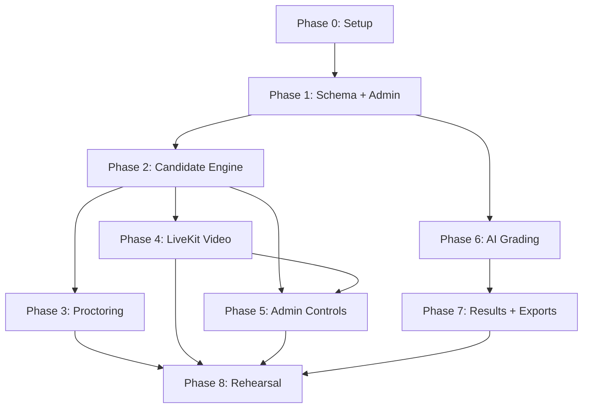

# Implementation Plan — Exam Platform

Detailed task breakdown for each phase. Tasks are ordered by dependency within each phase.

---

## Phase 0 — Setup (0.5–1 day)

**Dependencies:** none

### Tasks

| # | Task | Files | Details |
|---|---|---|---|
| 0.1 | Initialize Next.js + TypeScript | `apps/web/` | `npx create-next-app@latest` with App Router, TypeScript, ESLint |
| 0.2 | Install core dependencies | `package.json` | `@supabase/supabase-js`, `@supabase/ssr`, `iron-session`, `dompurify` |
| 0.3 | Supabase project setup | Supabase dashboard | Create project, note URL + anon key + service role key |
| 0.4 | Environment config | `.env.local`, `.env.example` | All variables from §14.1; `.env.example` with placeholder values for team reference |
| 0.5 | Supabase client helpers | `lib/supabase/server.ts`, `lib/supabase/client.ts` | Server client (service role), browser client (anon key for admin Realtime only) |
| 0.6 | iron-session config | `lib/session.ts` | Session options with `secure: process.env.NODE_ENV === 'production'`, cookie name, TTL = exam duration + 2 hours |
| 0.7 | Vercel project | Vercel dashboard | Connect repo, set env vars, confirm auto-deploy |
| 0.8 | Git repo + structure | root | Create folder structure from §14.6; initial commit |

**Done when:** deployed app reads a row from Supabase and iron-session creates a test cookie on localhost.

---

## Phase 1 — Schema, Admin Auth, Candidates, Questions (2–3 days)

**Dependencies:** Phase 0

### 1A — Database (0.5 day)

| # | Task | Files |
|---|---|---|
| 1A.1 | Write migration SQL | `supabase/migrations/001_initial.sql` |
| 1A.2 | Run migration | Supabase dashboard or CLI |
| 1A.3 | Enable RLS on all tables | Same migration |
| 1A.4 | RLS policy: admin full access | Same migration |
| 1A.5 | Enable Realtime | `attempts`, `violation_events`, `grading_jobs`, `grading_log`, `alerts` |
| 1A.6 | Create `snapshots` private bucket | Supabase Storage |
| 1A.7 | Seed super admin + admin users | `supabase/seed.sql` or manual |

### 1B — Admin Auth + Layout (0.5 day)

| # | Task | Files |
|---|---|---|
| 1B.1 | Admin login page | `app/(admin)/admin/login/page.tsx` |
| 1B.2 | Auth middleware | `middleware.ts` or layout-level check |
| 1B.3 | Admin layout with sidebar | `app/(admin)/admin/layout.tsx` |
| 1B.4 | Role-based access helper | `lib/auth.ts` — `requireAdmin()`, `requireSuperAdmin()` |

### 1C — Candidates (0.5 day)

| # | Task | Files |
|---|---|---|
| 1C.1 | NIC hashing utility | `lib/hashing.ts` — argon2/bcrypt + pepper |
| 1C.2 | Candidate list page | `app/(admin)/admin/candidates/page.tsx` |
| 1C.3 | Add/edit candidate form | `app/(admin)/admin/candidates/[id]/page.tsx` |
| 1C.4 | CSV import | `app/api/admin/candidates/import/route.ts` |
| 1C.5 | Candidate API routes | `app/api/admin/candidates/route.ts` |

### 1D — Exams (0.5 day)

| # | Task | Files |
|---|---|---|
| 1D.1 | Exam list page | `app/(admin)/admin/exams/page.tsx` |
| 1D.2 | Create/edit exam form | `app/(admin)/admin/exams/[id]/page.tsx` — includes `questions_per_paper`, `shuffle`, `flag_threshold`, schedule |
| 1D.3 | Assign candidates to exam | Same page or sub-page |
| 1D.4 | Exam API routes | `app/api/admin/exams/route.ts` |

### 1E — Question Builder (1 day)

| # | Task | Files |
|---|---|---|
| 1E.1 | Install Tiptap | `package.json` — `@tiptap/react`, `@tiptap/starter-kit`, extensions |
| 1E.2 | Tiptap editor component | `components/editor/TiptapEditor.tsx` |
| 1E.3 | Question builder page | `app/(admin)/admin/exams/[id]/questions/page.tsx` |
| 1E.4 | MCQ option editor | `components/editor/McqOptions.tsx` — add/remove options, mark correct |
| 1E.5 | Written answer fields | Model answer, grading notes, calibration examples |
| 1E.6 | Drag-and-drop ordering | Question position reordering |
| 1E.7 | Question API routes | `app/api/admin/questions/route.ts`, `app/api/admin/answer-keys/route.ts` |
| 1E.8 | DOMPurify sanitization | Sanitize all HTML before DB write |

**Done when:** an admin builds an exam with 40 questions (mixed MCQ + written), sets `questions_per_paper = 20`, assigns 23 candidates.

---

## Phase 2 — Candidate Login and Exam Engine (3–4 days)

**Dependencies:** Phase 1

### 2A — Candidate Auth (0.5 day)

| # | Task | Files |
|---|---|---|
| 2A.1 | Login page | `app/(candidate)/login/page.tsx` — MER code + NIC input |
| 2A.2 | Login API | `app/api/auth/login/route.ts` — verify hash, check `login_attempts` rate limit, create iron-session, revoke older sessions |
| 2A.3 | Rate limit check | Query `login_attempts` for count in last 10 min per MER and per IP |
| 2A.4 | Session middleware | `lib/session.ts` — `getSession()` helper for candidate routes |
| 2A.5 | Confirmation page | `app/(candidate)/confirm/page.tsx` — show name/outlet/photo, acknowledge button |
| 2A.6 | Acknowledge API | `app/api/auth/acknowledge/route.ts` |

### 2B — Waiting Room + Broadcast (0.5 day)

| # | Task | Files |
|---|---|---|
| 2B.1 | Broadcast channel hook | `lib/broadcast.ts` — subscribe to `exam:{examId}` channel |
| 2B.2 | Broadcast publish helper | `lib/broadcast-server.ts` — server-side publish for admin actions |
| 2B.3 | Waiting room page | `app/(candidate)/waiting/page.tsx` — countdown, camera preview, Broadcast listener |
| 2B.4 | Time sync | `app/api/time/route.ts` + `lib/time.ts` — server clock offset calculation |
| 2B.5 | Exam state API (fallback) | `app/api/exam/state/route.ts` — fallback if Broadcast missed |

### 2C — Paper Delivery + Question Pool (0.5 day)

| # | Task | Files |
|---|---|---|
| 2C.1 | Paper API | `app/api/exam/paper/route.ts` |
| 2C.2 | Question pool selection | If `questions_per_paper` set: check `attempt_questions` first; if empty, randomly select, save, return; if exists, return saved set |
| 2C.3 | Shuffle logic | If `shuffle` enabled: shuffle the selected subset before saving positions |

### 2D — Exam UI (1 day)

| # | Task | Files |
|---|---|---|
| 2D.1 | Exam page layout | `app/(candidate)/exam/page.tsx` — question list, timer, save indicator |
| 2D.2 | Question renderer | `components/exam/QuestionCard.tsx` — renders HTML body, MCQ radios, written textarea |
| 2D.3 | Timer component | `components/exam/Timer.tsx` — server-synced with offset |
| 2D.4 | Save indicator | `components/exam/SaveIndicator.tsx` — green/yellow/orange states |
| 2D.5 | MCQ answer handler | Radio button selection → state |
| 2D.6 | Written answer handler | Textarea with Unicode Sinhala support → state |

### 2E — Autosave + Offline (0.5 day)

| # | Task | Files |
|---|---|---|
| 2E.1 | IndexedDB helper | `lib/indexeddb.ts` — save/load/queue operations |
| 2E.2 | Autosave hook | `hooks/useAutosave.ts` — debounce 1s, periodic 10s, IndexedDB write, server upsert |
| 2E.3 | Retry queue | Failed saves queued and retried; indicator updates |
| 2E.4 | Answers API | `app/api/answers/route.ts` — upsert with `updated_at` conflict check, reject after deadline + 5s |

### 2F — Submit + Reconnect (0.5 day)

| # | Task | Files |
|---|---|---|
| 2F.1 | Submit API | `app/api/exam/submit/route.ts` — final flush, mark submitted |
| 2F.2 | Auto-submit on deadline | Client-side: flush answers, call submit |
| 2F.3 | Done page | `app/(candidate)/done/page.tsx` — "Submitted" confirmation |
| 2F.4 | Reconnect flow | Login with same MER + ID → load existing attempt, saved answers, same question subset, remaining time |
| 2F.5 | Worker scheduler | `worker/src/scheduler.ts` — 30s loop: finalize expired attempts, move scheduled→live exams |

**Done when:** a test candidate gets 20 random questions from 40, answers some, disconnects, reconnects and sees the same 20 questions with saved answers, and gets auto-submitted at deadline.

---

## Phase 3 — Proctoring and Logs (2–3 days)

**Dependencies:** Phase 2

### 3A — Proctoring Events (1 day)

| # | Task | Files |
|---|---|---|
| 3A.1 | Proctoring hook | `hooks/useProctoring.ts` — attaches all event listeners |
| 3A.2 | Visibility change handler | `visibilitychange` → `TAB_HIDDEN` |
| 3A.3 | Focus handler | `window blur` + 1s `document.hasFocus()` check → `FOCUS_LOST` |
| 3A.4 | Fullscreen handler | `fullscreenchange` → `FULLSCREEN_EXIT` + blocking overlay |
| 3A.5 | Viewport check | 1s interval: `innerWidth` vs `screen.width` → `VIEWPORT_CHANGED` (width-only on Android) |
| 3A.6 | Multi-screen check | `screen.isExtended` → `MULTI_SCREEN` |
| 3A.7 | Camera/mic loss handler | MediaStreamTrack `ended`/`mute` → `CAMERA_LOST` / `MIC_LOST` |
| 3A.8 | Copy/paste/context menu | Block and log `COPY`, `PASTE`, `CONTEXT_MENU` |
| 3A.9 | Reload detection | On page load during in-progress attempt → `RELOAD` |
| 3A.10 | Fullscreen overlay | `components/exam/FullscreenOverlay.tsx` — blocking until restored |

### 3B — Event Logging (0.5 day)

| # | Task | Files |
|---|---|---|
| 3B.1 | Events API | `app/api/events/route.ts` — accept event + optional snapshot |
| 3B.2 | Snapshot capture | `lib/snapshot.ts` — capture 320x240 JPEG from video element |
| 3B.3 | Snapshot upload | Upload to Supabase Storage `snapshots` bucket |
| 3B.4 | Heartbeat API | `app/api/heartbeat/route.ts` — update `last_seen_at` |
| 3B.5 | Heartbeat hook | `hooks/useHeartbeat.ts` — POST every 10s |

### 3C — Admin Violation View (0.5 day)

| # | Task | Files |
|---|---|---|
| 3C.1 | Violation timeline | `components/admin/ViolationTimeline.tsx` — per candidate, all events with snapshots |
| 3C.2 | Violation count badges | `components/admin/CandidateBadge.tsx` — count + red threshold |
| 3C.3 | Realtime violation updates | Subscribe to `violation_events` Realtime changes |

**Done when:** every event type in §8.1 appears in the admin log with a snapshot, including split view and side panel cases.

---

## Phase 4 — Live Video and Audio (2–3 days)

**Dependencies:** Phase 2 (candidate auth and exam engine must work)

### 4A — LiveKit Cloud Setup (0.5 day)

| # | Task | Files |
|---|---|---|
| 4A.1 | Install LiveKit SDK | `package.json` — `livekit-client`, `@livekit/components-react` |
| 4A.2 | LiveKit Cloud account | Create free account, get API key + secret |
| 4A.3 | Token generation | `app/api/livekit/token/route.ts` — candidate (publish-only) + admin (subscribe-only, hidden) |

### 4B — Candidate Publishing (0.5 day)

| # | Task | Files |
|---|---|---|
| 4B.1 | Camera/mic hook | `hooks/useLiveKit.ts` — connect, publish camera at 320x240 + mic |
| 4B.2 | Integrate into waiting room | Start publishing on entering waiting room |
| 4B.3 | Integrate into exam | Keep publishing during exam |
| 4B.4 | Degradation banner | `components/exam/CameraBanner.tsx` — "Camera disconnected" warning; non-blocking |

### 4C — Admin Grid (1 day)

| # | Task | Files |
|---|---|---|
| 4C.1 | Live grid page | `app/(admin)/admin/live/page.tsx` |
| 4C.2 | Video tile component | `components/admin/VideoTile.tsx` — MER label, name, status badge, violation count, speaker button |
| 4C.3 | Manual subscription | Subscribe to all video tracks; audio only when speaker toggled on |
| 4C.4 | Tile enlarge | Click tile to enlarge + show violation timeline |
| 4C.5 | Status badges | Not joined, Ready, In exam, Offline, Submitted, Camera Off |

### 4D — Self-hosted LiveKit on EC2 (1 day)

| # | Task | Files |
|---|---|---|
| 4D.1 | EC2 setup | Ubuntu, Docker, Elastic IP |
| 4D.2 | DuckDNS setup | Free subdomain pointing to Elastic IP |
| 4D.3 | LiveKit Docker Compose | `infra/livekit/docker-compose.yml` — LiveKit server, Caddy, Redis |
| 4D.4 | Caddy config | `infra/livekit/Caddyfile` — HTTPS with DuckDNS + Let's Encrypt |
| 4D.5 | Security group | TCP 443, 7881; UDP 3478, 50000–60000; SSH restricted |
| 4D.6 | Swap file | 2 GB swap |
| 4D.7 | Switch `LIVEKIT_URL` | Point to self-hosted instance |
| 4D.8 | Load test | Test with multiple publishers; monitor CPU and bandwidth |

**Done when:** grid stays smooth with test tiles; any candidate can be heard on demand; LiveKit disconnect shows the warning without blocking the exam.

---

## Phase 5 — Admin Controls, Pre-exam Check, Super Admin (1–2 days)

**Dependencies:** Phase 2 (exam engine), Phase 4 (LiveKit for pre-exam check)

### 5A — Admin Controls (0.5 day)

| # | Task | Files |
|---|---|---|
| 5A.1 | Start now API | `app/api/admin/exams/[id]/start/route.ts` — set `started_at`, publish Broadcast `exam_started` |
| 5A.2 | Extend API | `app/api/admin/exams/[id]/extend/route.ts` — all or one; publish time update |
| 5A.3 | Force-end API | `app/api/admin/exams/[id]/force-end/route.ts` — submit all attempts; publish `exam_ended` |
| 5A.4 | Force-submit + kick | `app/api/admin/attempts/[id]/force-submit/route.ts`, `/kick/route.ts` |
| 5A.5 | Broadcast API | `app/api/admin/exams/[id]/broadcast/route.ts` — save to `broadcasts`, publish to channel |
| 5A.6 | Admin action logging | Write all actions to `admin_actions` |
| 5A.7 | Exam edit restrictions | UI disables fields based on exam status (draft/scheduled: full edit; live: extend/force-end only) |

### 5B — Pre-exam Check (0.5 day)

| # | Task | Files |
|---|---|---|
| 5B.1 | Pre-exam check page | `app/(candidate)/check/page.tsx` |
| 5B.2 | Chrome check | `navigator.userAgentData.brands` check |
| 5B.3 | Camera preview | Show video feed, confirm working |
| 5B.4 | Mic level | Show mic input level indicator |
| 5B.5 | Fullscreen test | Request fullscreen, confirm it works |
| 5B.6 | Network check | Test API connectivity |
| 5B.7 | Monitor check | `screen.isExtended` warning |
| 5B.8 | Wake Lock | Request Screen Wake Lock |

### 5C — Super Admin (0.5 day)

| # | Task | Files |
|---|---|---|
| 5C.1 | Health check page | `app/(admin)/admin/health/page.tsx` |
| 5C.2 | Health API | `app/api/admin/health/route.ts` — check Supabase, LiveKit, Gemini keys, worker heartbeat |
| 5C.3 | Alerts display | Show active alerts from `alerts` table via Realtime |
| 5C.4 | Resolve alert API | `app/api/admin/alerts/[id]/resolve/route.ts` |

**Done when:** Start now triggers Broadcast; extend/force-end work; pre-exam check validates all requirements; health page shows all-green status.

---

## Phase 6 — AI Grading (3–4 days)

**Dependencies:** Phase 1 (schema), Phase 2 (attempts and answers must exist)

### 6A — Worker Core (1 day)

| # | Task | Files |
|---|---|---|
| 6A.1 | Worker entry point | `worker/src/index.ts` — main loop |
| 6A.2 | Key manager | `worker/src/keys.ts` — pick active key, handle cooldown/disabled states |
| 6A.3 | Key state table init | Seed `api_key_state` with key1, key2, key3 |
| 6A.4 | Job picker | `worker/src/grader.ts` — pick pending job, lock, process |
| 6A.5 | Stuck job reset | Reset jobs stuck in 'running' for >2 min |
| 6A.6 | Health heartbeat | Write timestamp to `alerts` or a health row every 30s |

### 6B — Gemini Integration (1 day)

| # | Task | Files |
|---|---|---|
| 6B.1 | Prompt builder | `worker/src/prompt.ts` — system instruction + user message from §12.2 |
| 6B.2 | Gemini API caller | `worker/src/gemini.ts` — call with JSON schema, temperature 0 |
| 6B.3 | Response parser | Validate JSON, clamp marks to 0..max, set `needs_review` flags |
| 6B.4 | Error handling | 429 → cooldown; 400/403 → disabled + alert; 5xx → retry with backoff; bad JSON → retry once |
| 6B.5 | Logging | Write every event to `grading_log` |

### 6C — MCQ Scoring + Results (0.5 day)

| # | Task | Files |
|---|---|---|
| 6C.1 | MCQ scorer | Code-based: compare `selected_option_id` with `answer_keys.correct_option_id` |
| 6C.2 | Results calculator | `total_marks` = sum of marks for candidate's assigned questions; `total_percent` = `(mcq + written) / total * 100` |
| 6C.3 | Results write | Upsert into `results` table |

### 6D — Grading API + Admin UI (1 day)

| # | Task | Files |
|---|---|---|
| 6D.1 | Start grading API | `app/api/admin/exams/[id]/grade/route.ts` — create `grading_runs` + `grading_jobs` |
| 6D.2 | Resume API | `app/api/admin/grading/[run]/resume/route.ts` |
| 6D.3 | Grading progress page | `app/(admin)/admin/results/page.tsx` — progress bar, key states, log |
| 6D.4 | Review screen | `app/(admin)/admin/results/[attempt]/page.tsx` — per-question: candidate answer, model answer, AI marks, reason, matched/missing points, confidence |
| 6D.5 | Override API | `app/api/admin/results/[attempt]/override/route.ts` |
| 6D.6 | Regrade API | Regrade single question → new grading job |

### 6E — Prompt Testing (0.5 day)

| # | Task | Files |
|---|---|---|
| 6E.1 | Test script | `worker/scripts/test-prompt.ts` — run prompt on sample answers |
| 6E.2 | Test with Singlish/Sinhala | 10–15 sample answers including mixed language |
| 6E.3 | Calibration tuning | Adjust grading notes and calibration examples based on results |

**Done when:** full 23-paper run completes; one key deliberately broken → worker fails over and alerts super admin; MCQ + written scores calculated correctly.

---

## Phase 7 — Results and Exports (1–2 days)

**Dependencies:** Phase 6

### Tasks

| # | Task | Files |
|---|---|---|
| 7.1 | Results summary page | `app/(admin)/admin/results/summary/page.tsx` — all 23 candidates, total scores |
| 7.2 | Per-candidate detail page | `app/(admin)/admin/results/[attempt]/page.tsx` — questions (from their subset), answers, marks, violations |
| 7.3 | Print/PDF page | `app/(admin)/admin/results/[attempt]/print/page.tsx` — print-styled, Noto Sans Sinhala, optional examiner answers |
| 7.4 | Summary CSV export | `app/api/admin/results/export/route.ts` — all scores + which questions each candidate received |
| 7.5 | Question subset indicator | Show which questions each candidate got (if pool used) |

**Done when:** PDF exports correctly with Sinhala text; CSV contains all scores and question assignments.

---

## Phase 8 — Rehearsal and Hardening (2 days)

**Dependencies:** All previous phases

### Tasks

| # | Task | Details |
|---|---|---|
| 8.1 | Create practice exam | Flag `is_practice`, add 10 dummy questions |
| 8.2 | Rehearsal with 3–5 people | Real laptops + Android tabs |
| 8.3 | Test split view | Chrome split view, Windows Snap, side panel |
| 8.4 | Test Android split-screen | Split-screen mode, floating window |
| 8.5 | Test network drop | Disconnect for 2 min, reconnect |
| 8.6 | Test LiveKit disconnect | Kill LiveKit → warning banner, exam continues |
| 8.7 | Test multi-login | Same MER in two browsers |
| 8.8 | Test question pool | Verify different candidates get different subsets; verify reconnect gets same subset |
| 8.9 | Test auto-submit | Deadline reached → auto-submit |
| 8.10 | Test grading | Full grading run with sample answers |
| 8.11 | Tune thresholds | Adjust `flag_threshold`, viewport % tolerance, focus delay |
| 8.12 | Finalize runbook | Update §18 based on rehearsal findings |
| 8.13 | Fix issues | Address any bugs found during rehearsal |

**Done when:** full rehearsal passes with no blocking issues; runbook is finalized.

---

## Phase Dependency Map

> [!TIP]
> **Phase 4 (LiveKit) and Phase 6 (AI Grading) can run in parallel** since they don't depend on each other. If you want to see the exam working end-to-end faster, prioritize Phases 0→1→2→6→7, then come back to Phases 3→4→5.

---

## Quick Reference: Total File Count

| Category | Estimated files |
|---|---|
| Pages (candidate) | ~7 (login, confirm, check, waiting, exam, done, fallback) |
| Pages (admin) | ~10 (login, dashboard, candidates, exams, questions, live, results, review, print, health) |
| API routes | ~20 |
| Components | ~15 |
| Hooks | ~5 (useAutosave, useProctoring, useHeartbeat, useLiveKit, useBroadcast) |
| Lib utilities | ~8 (supabase, session, hashing, time, broadcast, snapshot, indexeddb, livekit) |
| Worker | ~6 (index, grader, keys, scheduler, prompt, health) |
| Infra | ~3 (docker-compose, Caddyfile, LiveKit config) |
| **Total** | **~74 files** |
